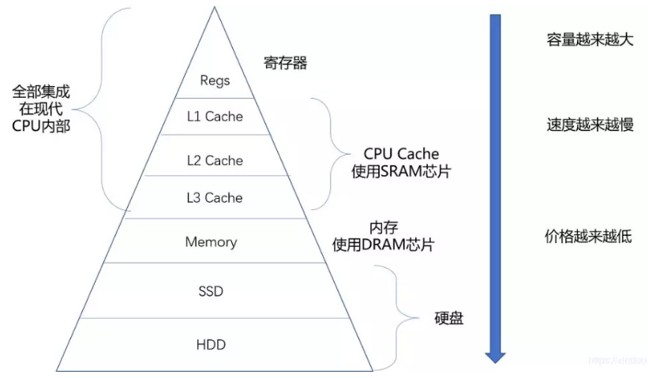
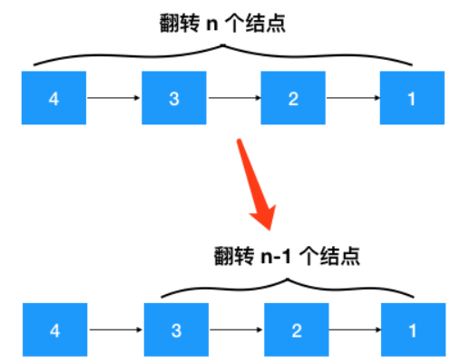
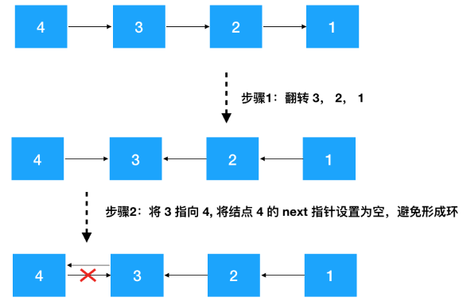
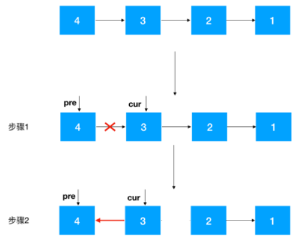
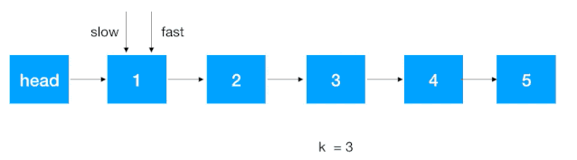
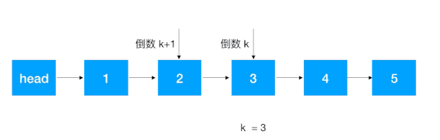
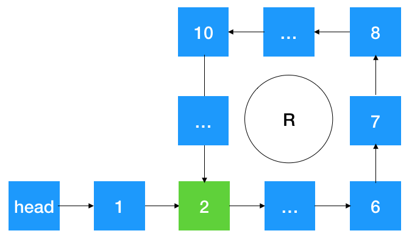
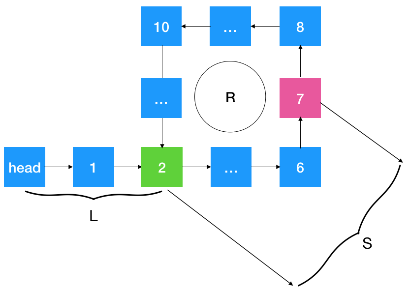

# 链表（linked list）

<!-- TOC -->

- [链表（linked list）](#链表linked-list)
    - [1. 链表的定义和特点](#1-链表的定义和特点)
    - [2. 链表的实现](#2-链表的实现)
    - [3. 链表翻转](#3-链表翻转)
        - [3.1 递归翻转](#31-递归翻转)
        - [3.2 迭代翻转](#32-迭代翻转)
    - [4.链表之快慢指针](#4链表之快慢指针)
        - [4.1 寻找/删除第k个结点](#41-寻找删除第k个结点)
        - [4.2 判断两个链表是否相交及找到第一个交点，空间复杂度$O(1)$](#42-判断两个链表是否相交及找到第一个交点空间复杂度o1)
        - [4.3 判断链表是否环，如果有，找到环的入口位置，要求空间复杂度为$O(1)$](#43-判断链表是否环如果有找到环的入口位置要求空间复杂度为o1)

<!-- /TOC -->

## 1. 链表的定义和特点

**链表：** 是物理存储单元上链式（非连续、非顺序）的存储结构，它由一个个结点，通过指针联系起来，每个结点包含了数据域和指针域。  
**线性表的存储方式**  
| |链表|数组（顺序表）|
|-|-|-|
|查找的时间复杂度|$O(n)$|$O(1)$|
|插入删除的时间复杂度|给出具体位置下$O(1)$|要移动数据$O(n)$|
|适用情景|频繁的插入和删除，或所需空间较大|很少插入和删除，以查找为主|

**注意：** 数组相比于链表优点在于：  
（1）查找性能  
（2）**程序的局部性原理：** cpu到内存中读取数据是很耗时的，所以在CPU与内存间往往集成了多级缓存，缓存越接近CPU，速度越快。CPU在访问某个内存单元时，其附近的数据会被加载到缓存中，由于数组是连续存储的，这样CPU访问数组时，就会把存放数组的那一整块内存都加载进缓存中，这样CPU访问数组就会很快。


由于链表的每个结点在内存里都是随机分配的，只是通过指针联系在一起，所以这些结点的地址并不相邻，故无法利用程序的局部性原理来提升性能。

## 2. 链表的实现

**结点的实现:** 由于结点的元素类型不确定，所以采用cpp模板机制，这里采用了结构体（成员是公有的）来设计，也可以采用类来设计  

```cpp
template<class DataType>
struct Node
{
    DataType data;//数据域
    Node<DataType>* next;//指针域
}
```

**单链表的实现:**

```cpp
template<class DataType>
class LinkList
{
    private:
        Node<DataType>* head;//头指针，指向头结点
    public:
        LinkList();
        LinkList(DataType a[], int n);//构造函数（无参数和有参数）
        ~LinkList();//析构函数
        int Length();//求单链表长度
        DataType Get(int i);//按位查找
        int Locate(DataType x);//按值查找
        void Insert(int i; DataType x);//按位插入
        DataType Delete(int i);//按位删除
        void PrintList();//遍历
}
```

**无惨构造函数（只有头结点的空链表）：**

```cpp
template<class DataType>
LinkList<DataType>::LinkList()
{
    head = new Node;//head指向头结点
    head->next = null;//头结点的指针域置空
}
```

关于链表的**头结点**需要注意的地方：一般来说，在链表的开始之前附设一个类型相同的结点作为头结点（头结点之后才是我们要存放的数据，头结点也可称为**哨兵**），这样，无论单链表是否为空，头指针永远指向头结点（头指针不会为空），统一了空表和非空表的一些操作，使得我们存放数据的第一个节点和后面的结点统一操作，不需要特殊处理。指向头结点的头指针告诉了我们链表的起始位置。
**有参构造函数（生成有n个结点的单链表）：**
（1）头插法：逆序构造链表

```cpp
template<class DataType>
LinkList<DataType>::LinkList(DataType a[], int n)
{
    head = new Node;
    head->next = null;//初始化一个空链表
    Node<DataType>* temp;//结点指针作为媒介
    for(int i=0; i<n; i++)
    {
        temp = new Node;
        temp->data = a[i];//生成结点，每个结点存放一个元素
        temp->next = head->next;
        head->next = temp;//结点temp插在头结点后面
    }
```

（2）尾插法：顺序构造链表

```cpp
template<class DataType>
LinkList<DataType>::LinkList(DataType a[], int n)
{
    head = new Node;
    Node<DataType>* temp;
    Node<DataType>* end = head;//头结点就是尾，从尾部插入
    for(int i=0; i<n; i++)
    {
        temp = new Node;
        temp->data = a[i];//生成结点
        end->next = temp;//尾部插入，此时end指向的是倒数第二个结点
        end = temp;//end和temp指向同一个结点，更新end为指向最后一个结点
    }
    end->next = null;//最后，要把最后一个结点的指针置空
}
```

**求链表长度：**

```cpp
template<class DataType>
int LinkList<DataType>::Length()
{
    Node<DataType>* p = head->next;
    int count = 0;
    while(p != null)
    {
        p = p->next;
        count++;
    }
    return count;
}
```

**查找操作：**
（1）按位查找：

```cpp
template<class DataType>
DataType LinkList<DataType>::Get(int i)
{
    Node<DataType>* p = head->next;
    for(int j=1; j<i; j++)
    {
        p = p->next;
    }
    return p->data;
}
```

（2）按值查找：

```cpp
template<class DataType>
int LinkList<DataType>::Locate(DataType x)
{
    Node<DataType>* p = head->next;
    int count = 1;
    while(p != null)
    {
        if(p->data == x) return count;
        count++;
        p = p->next;
    }
    return 0;//0表示查找失败
}
```

**插入操作：**

```cpp
template<class DataType>
void LinkList<DataType>::Insert(int i, DataType x)
{
    Node<DataType>* p = head;//工作指针指向头结点
    Node<DataType>* temp = new Node;
    temp->data = x;
    for(int j=1; j<i; j++)
        p = p->next;
    temp->next = p->next;
    p->next = temp;
```

**删除操作：**

```cpp
template<class DataType>
void LinkList<DataType>::Delete(int i)
{
    Node<DataType>* p = head;//工作指针指向头结点
    Node<DataType>* temp;
    int count = 0;
    while(p!=null && count<i-1)//遍历至第i-1个结点
    {
        p = p->next;
        count++;
    }
    if(p==null || p->next==null) throw "第i个结点不存在"；
    else
    {
        temp = p->next;
        DataType x = temp->data;//暂存被删结点
        p->next = temp->next;//摘链
        delete temp;
        return x;
    }
}
```

**遍历操作：**

```cpp
template<class DataType>
void LinkList<DataType>::PrintList()
{
    Node<DataType>* p = head->next;//工作指针初始化指向第一个结点
    while(p!=null)
    {
        std::cout << p-data << std::endl;
        p = p->next;//工作指针后移，注意不能写作p++
    }
}
```

## 3. 链表翻转

### 3.1 递归翻转

**思路：** 翻转n个结点，只要翻转第1个结点之后的n-1个结点，然后把第2个结点指向第一个结点，最后把第1个结点指向空。这样翻转n个结点的问题就转化为翻转n-1个结点的问题，可以递归下去。  

**过程：**
（1）定义递归函数：该函数翻转某个结点开始的链表，然后返回新的头结点；
（2）递推公式：

- 针对结点node,先翻转node之后的结点invert(node->next);
- 再把node结点的下个结点（就是node后面结点的第一个结点），指向node，把node结点的指向置空；
- 返回新的头结点，重新设置head。

（3）递归函数中调用递推公式
（4）计算复杂度：

- 时间复杂度：调用了n次函数，所以$O(n)$
- 空间复杂度：没有用到额外空间，但是n次递归调用了n次函数，压了n次栈，所以$O(n)$

```cpp
Node<DataType>* InvertList(Node<DataType>* node)
{
    if(node->next == null) return node;//边界，node是最后一个结点
    Node<DataType>* newhead = InvertList(node->next);//翻转node后面的结点
    //把node后一个结点的指向置为node,node的指向置为null
    node->next->next = node;
    node->next = null;
    //返回翻转后的头结点
    return newhead;
}
```

### 3.2 迭代翻转

由于递归容易导致栈溢出，顾可以使用非递归的迭代法。
**思路：**
（1）定义两个节点：pre, cur，首次定义时，要把pre指向cur的指针去掉，避免后面形成环
（2）把cur指向pre,然后把cur设置为pre，cur的后继节点设为cur，一直重复此步骤，直至最后一个结点
（3）最后翻转完了，记得要重新设置头结点


```cpp
Node<DataType>* IterationInvertList(Node<DataType>* node)
{
    Node<DataType>* pre = head;
    Node<DataType>* cur = head->next;
    pre->next = null;//pre是头结点，避免翻转后形成环

    while(cur != null)
    {
        Node<DataType>* temp = cur->next;//在cur指向pre之前，要先保存cur的后继结点
        cur->next = pre;
        pre = cur;
        cur = temp;
    }
    head->next = pre;//此时pre指向的是原链表的尾结点，翻转后即为head的后继结点
}
```

**复杂度：**

- 时间复杂度：循环了n次，$O(n)$
- 空间复杂度：没有额外空间的使用，$O(1)$

## 4.链表之快慢指针

### 4.1 寻找/删除第k个结点

题：**返回链表的中间结点，如果有两个中间结点，则返回第二个中间结点**
（1）若题中或链表的头结点存放了链表的长度length

```cpp
Node<DataType>* findMidNode(Node<DataType>* head)
{
    Node<DataType>* tmp = head->next;
    int midlength = length/2;
    while(midlength>0)
    {
        tmp = tmp->next;
        midlength--;
    }
    return tmp;
}
```

(2)若没有length，则就要遍历一遍链表拿到链表长度，然后再从头结点开始遍历length/2次即为中间结点

```cpp
Node<DataType>* findMidNode(Node<DataType>* head)
{
    Node<DataType>* tmp = head->next;
    int length = 1;
    //遍历一遍得到链表长度
    while(tmp->next != null)
    {
        tmp = tmp->next;
        length++;
    }
    //再遍历一遍得到中间结点
    tmp = head->next;
    int midlength = length/2;
    while(midlength > 0)
    {
        tmp = tmp->next;
        midlength--;
    }
    retrun tmp;
}
```

（3）可以看出（2）遍历两次链表，效率不高，引入快慢指针（two pointers），只需遍历一次，步骤如下：

- 快慢指针同时指向head的后继结点
- 慢指针走一步，快指针走两步
- 重复上一步骤，停下位置取决于链表的长度是奇数还是偶数
  
>- 如果链表长度为奇数，当fast->next = null时，slow为中间结点
>
>- 如果链表长度为偶数，当fast=null时，slow为中间结点
>

- 由上分析可知：当fast=null 或 fast->next=null 时，此时slow结点即为中间结点

```cpp
Node<DataType>* findMidNode(Node<DataType>* head)
{
    Node<DataType>* fast = head->next;
    Node<DataType>* slow = fast;
    while(fast != null && fast->next != null)
    {
        fast = fast->next->next;
        slow = slow->next;
    }
    return slow;
}
```

题：**查找链表的倒数第k个结点**
**分析：** 暴力法固然可以，但需要遍历两次，不高效，可以使用快慢指针，只需遍历一次

- 首先让快慢指针同时指向head的后继结点
- 快指针往前走k-1步，先走到第k个结点（此时两个指针之间有k-2个结点）
- 快慢指针同时往后走一步，不断重复此步骤，直至快指针走到尾结点，此时的slow结点即为倒数第k个结点（因为两个指针之间固定有k-2个结点）

**注意：** 临界情况是k>length，这种情况应该抛异常

```cpp
Node<DataType>* FindKthNode(Node<DataType>* head)
{
    Node<DataType>* fast = head->next;
    Node<DataType>* slow = fast;
    //快指针先移到第k个结点
    int tmpK = k-1;
    while(tmpK > 0 && fast != null)
    {
        fast = fast->next;
        tmpK--;
    }
    //临界条件：k大于链表长度
    if(fast == null)
    {
        throw "异常"；
    }
    //slow和fast同时后移，直到fast移到尾结点
    while(fast->next != null)
    {
        slow = slow->next;
        fast = fast->next;
    }
    return slow;
}
```

题：**单链表向右旋转k个位置**
**思路：**

- 先找到倒数第k+1个结点，此结点的后继结点即为倒数第k个结点
- 将倒数第k+1个结点的后继结点置为null
- 将head的后继结点设置为以上所得的倒数第k个结点，将原尾结点的后继结点设置为原head的后继结点


```cpp
void ReverseKthNode(int k, Node<DataType>* head)
{
    Node<DataType>* KpreNode = FindKthNode(k+1);//倒数第k+1个结点
    Node<DataType>* KNode = KpreNode->next;//倒数第k个结点
    Node<DataType>* headNext = head->next;//暂存第1个结点
    KpreNode->next = null;
    head->next = KNode;
    //寻找尾结点
    Node<DataType>* tmp = KNode;
    while(tmp->next != null)
    {
        tmp = tmp->next;
    }
    //尾结点的后继结点设置为第一个结点（原head的后继结点）
    tmp->next = headNext;
}
```

题：**删除倒数第k个结点**

```cpp
void DeleteKthList(int k, Node<DataType>* head)
{
    Node<DataType>* KpreNode = FindKthNode(k+1);//找到倒数第k+1个结点
    Node<DataType>* tmp = KpreNode->next;//被删结点
    KpreNode->next = tmp->next;
    delete tmp;
}
```

### 4.2 判断两个链表是否相交及找到第一个交点，空间复杂度$O(1)$

**注：** 如果没有空间复杂度 O(1) 的限制，其实有多种解法，一种是遍历链表 1，将链表 1 的所有的结点都放到一个 set 中，再次遍历链表 2，每遍历一个结点，就判断这个结点是否在 set，如果发现结点在这个 set 中，则这个结点就是链表第一个相交的结点
**分析：** 由于链表本身的性质，如果有一个结点相交，那么相交结点之后的所有结点都是这两个链表共用的，也就是说**两个链表的长度主要相差在相交结点之前的结点长度**  
**思路：**  
（1）先遍历两个链表得到两个链表长度L1，L2（L1>=L2），定义p1,p2分别指向各自链表head结点，然后p1先往前走L1-L2步。这样就保证了p1，p2指向的结点与相交结点（若有）一样远

（2）p1，p2不断往后遍历，每次走一步，边遍历边判断相应结点是否相等，相等则为相交结点  

```cpp
Node<DataType>* DetectCommonNode(Node<DataType>* head1, Node<DataType>* head2)
{
    int length1(0), length2(0);
    Node<DataType>* p1 = head1;
    Node<DataType>* p2 = head2;
    //遍历得两个链表的长度
    while(p1->next != null)
    {
        length1++;
        p1 = p1->next;
    }
        while(p2->next != null)
    {
        length2++;
        p1 = p2->next;
    }
    p1 = head1;
    p2 = head2;
    //p1或p2前进|length1-length2|步
    if(length1 >= length2)
    {
        int difflength = length1 - length2;
        while(difflength > 0)
        {
            p1 = p1->next;
            difflength--;
        }
    }
    else
    {
        int difflength = length2 - length1;
        while(difflength > 0)
        {
            p2 = p2->next;
            difflength--;
        }
    }
    //p1，p2分别往后遍历，边遍历边比较，如果相等则为第一个交点
    while(p1 != null && p2-next != null)
    {
        p1 = p1->next;
        p2 = p2->next;
        if(p1 == p2) return p1;
    }
    //没有相交点，返回空指针
    return null;
}
```

### 4.3 判断链表是否环，如果有，找到环的入口位置，要求空间复杂度为$O(1)$


**分析：** 若从head开始遍历，则遍历指针一定会在以上的环中绕圈子，所以可以分别定义快慢指针，慢指针走一步，快指针走两步，由于最后快慢指针在遍历过程中一直会在圈中绕，且二者的步长不一致，所以它们在绕圈子的过程中一定会相遇（好比绕操场跑圈，跑的快的最终会多绕一圈然后追上慢的）  

```cpp
Node<DataType>* DetectCrossNode(Node<DataType>* head)
{
    Node<DataType>* fast = head;
    Node<DataType>* slow = slow;
    while(fast != null && fast->next != null)
    {
        fast = fast->next->next;
        slow = slow->next;
        if(fast == slow)
        {
            return fast;//返回快慢指针在环中相遇的结点
        }
    }
    return null;
}
```

下面寻找环的入口结点：

假设上图中的 7 为快慢指针相遇的结点，不难分析出相遇时**慢指针走了 L + S 步**，快指针呢，它走得比慢指针更快，它除了走了 L + S 步外，还额外在环里绕了 n  圈，所以**快指针走了 L+S+nR 步**（R 为图中环的长度）, 另外我们知道每遍历一次，慢指针走了一步，快指针走了两步，所以**快指针走的路程是慢指针的两倍**, 即 **2(L+S) = L+S+nR**，可得**L+S = nR**即可得**L = nR - S**  

- 当n=1时，即 L+S = R 时, 则从相遇点 7 开始遍历走到环入口点 2 的距离为 **R - S = L**，刚好是环的入口结点, 而 head 与环入口点 2 的距离恰好也为 L，所以**只要在头结点定义一个指针，在相遇点（7）定义另外一个指针，两个指针同时遍历，每次走一步，必然在环的入口位置 2 相遇**
- 当 n > 1 时，L + S = nR, 即 L = nR - S,  nR-S 怎么理解？如果指针指向相遇结点  7 ，则此指针走了 n 圈后，回退 S 步，此时刚好指向环入口位置，也就是说如果**设置一个指针指向 head（定义为 p1）, 另设一个指针指向相遇点（7）（定义为 p2），不断遍历，p2 走了 nR-S 时（即环的入口位置），p1 也刚好走到这里（此时 p1 走了 nR-S =  L 步，刚好是环入口位置），即两者相遇**

**综上所述：** 要找到入口结点，只需定义两个指针，一个指针指向 head, 一个指针指向快慢指针的相遇点，然后这两个指针不断遍历（每次走一步），当它们指向同一个结点时即是环的入口结点

```cpp
Node<DataType>* GetEntryNode(Node<DataType>* head)
{
    //获取快慢指针相遇的结点
    Node<DataType>* crossNode = DetectCrossNode(Node<DataType>* head);
    //如果没有相遇点，则没有环
    if(crossNode == null) return null;
    //分别定义两个指针，一个指向头结点，一个指向快慢指针的相交结点
    Node<DataType>* tmp1 = head;
    Node<DataType>* tmp2 = crossNode;
    //两者相遇点即为环的入口结点
    while(tmp1 != tmp2)
    {
        tmp1 = tmp1->next;
        tmp2 = tmp2->next;
    }
    return tmp1;
}
```
