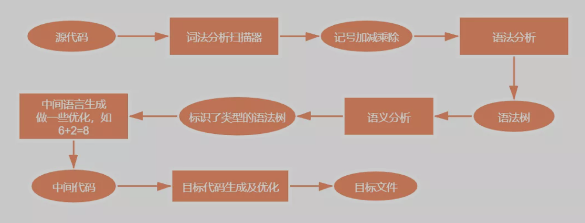
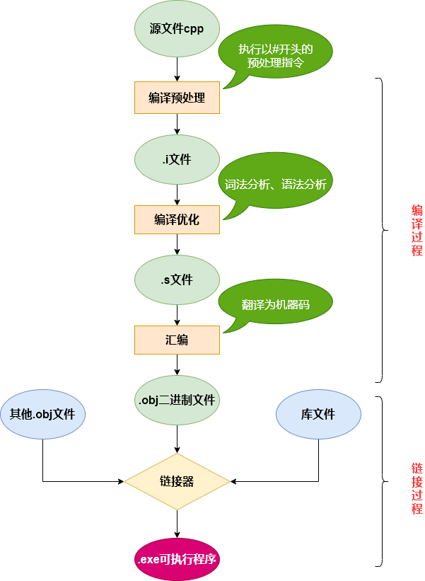
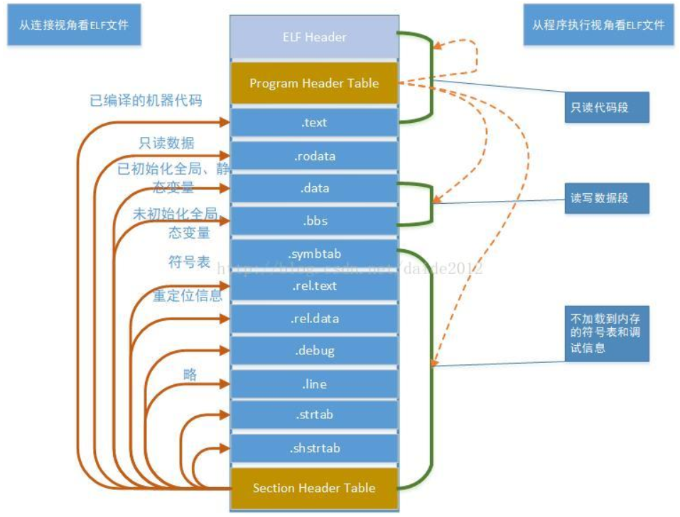
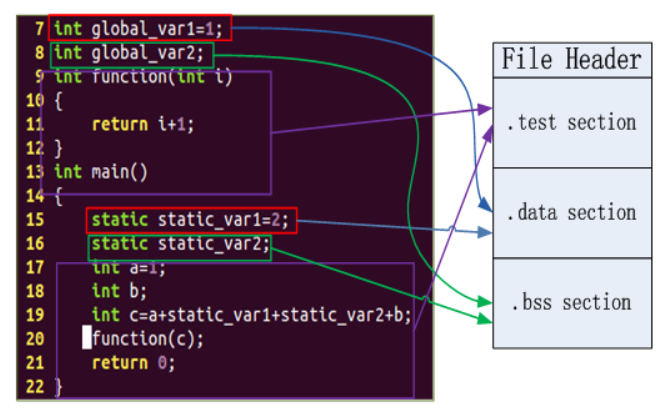

# 编译过程

整个编译过程大致分为两步：

1. 编译：把文本形式的源代码翻译成极其语言，并形成目标文件
2. 链接：把目标文件、操作系统的启动代码和库文件组织起来形成可执行程序

## 1 编译

### 1.1 编译预处理

- 预处理就是做一些代码文本替换工作。编译器执行**预处理指令(以#开头)**，会得到不含#的`.i`文件。
- 拷贝`#include`包含的代码，进行`#define`宏定义的替换，处理条件编译指令(`#ifndef`、`#ifdef`、`#endif`)
- 删除程序中所有的注释
- 添加行号和文件名标识，方便编译器产生警告及调试信息
- 保留所有的#pragma编译器指令，因为编译器会使用他们

### 1.2 编译优化



- 通过词法分析和语法分析，确定所有指令是否符合规则，之后翻译成汇编代码
- 将`.i`文件转换成`.s`文件
- 词法分析：又称词法扫描，通过扫描器，利用有限状态机的算法将源码中的字符串分割成一系列记号，如加减乘除数字括号等。
- 语法分析：使用语法分析器对词法分析产生的记号运用上下文无关语法的手段进行语法分析，产生语法分析树。这期间如果表达式不合法（括号不匹配等），就会报错。
- 语义分析：语法分析检查表达式是否合法，语义分析检查表达式是否有意义，如浮点型整数赋值给指针，编译器就会报错。
- 中间语言生成：做一些语法树优化，如6+2=8

### 1.3 汇编

- 汇编过程就是把汇编语言翻译成目标机器指令，生成`.obj`目标文件。
- 目标文件由段组成，至少有两个段:
  - 代码段：包含主要程序的指令。该段可读可写，不可写
  - 数据段：存放程序用到的全局变量或静态数据。可读可写可执行

## 2 链接

`.obj`文件不能立即执行，还要通过链接过程（将相关的目标文件链接起来，将`.obj`文件转换为可执行文件），这是因为：

- 一个源文件可能调用了另一个源文件的函数或常量
- 在程序中调用了某个库文件中的函数

**总结：**  



## 3 程序链接及分段

**链接的是目标文件**。目标文件就是源代码编译后但未进行链接的那些中间文件，如Linux下的.o，它和可执行文件的内容和结构很相似，格式几乎是一样的，可以看成是同一种类型的文件，Linux下统称为**ELF(Executable and Linkable Format，可执行链接格式)文件**。

**目标文件(ELF文件)的四种形式：**  
|ELF文件|描述|
|-|-|
|可重定位文件（Relocatable File）|包含二进制代码和数据，可被链接成可执行目标文件或共享目标文件，例如静态链接库`.a`文件，经过预编译、编译、汇编后的`.o`文件|
|可执行文件（Executable File）|包含二进制代码和数据，可以直接被加载器执行，如 / bin/bash|
|共享目标文件（Shared Object File）|Linux中的`.so`文件，包含代码和数据，一种是链接器可以使用这种文件和其它的可重定位文件和共享目标文件链接，产生新的目标文件；另一种是动态链接器可以将几个共享目标文件与可执行文件结合，作为进程映像的一部分来运行|
|核心转储文件（Core Dump File）|进程意外终止时，系统可以将该进程的地址空间的内容和其它信息存到coredump文件用于调试，如gdb|

**ELF文件格式提供了两种不同的视角：**

**三个索引表：** ELF header，Program header table，Section header table

- 在**汇编器和链接器** 看来，ELF 文件是由**段表(Section Header Table)** 描述的一系列 Section 的集合
- 在**加载器（Loader）** 看来而执行一个 ELF 文件时，它是由**程序表(Program Header Table)** 描述的一系列 Segment 的集合。

- 左边是从汇编器和链接器的视角来看这个文件，开头的 ELF Header 描述了体系结构和操作系统等基本信息，并指出 Section Header Table 和 Program Header Table 在文件中的什么位置，Program Header Table 在汇编和链接过程中没有用到，所以是可有可无的，Section Header Table 中保存了所有 Section 的描述信息。
- 右边是从加载器的视角来看这个文件，开头是 ELF Header，Program Header Table 中保存了所有 Segment 的描述信息，Section Header Table 在加载过程中没有用到，所以是可有可无的。
- 注意 Section Header Table 和 Program Header Table 并不是一定要位于文件开头和结尾的，其位置由 ELF Header 指出，上图这么画只是为了清晰。
- 目标文件需要链接器做进一步处理，所以一定有 Section Header Table；可执行文件需要加载运行，所以一定有Program Header Table；而共享库既要加载运行，又要在加载时做动态链接，所以既有 Section Header Table 又有 Program Header Table。

**目标文件的构成：** 主要包括文件头、代码段、数据段和其它

|目标文件的组成部分|描述|
|-|-|
|ELF文件头|描述整个文件的文件属性（文件是否可执行、是静态链接还是动态链接、入口地址、目标硬件、目标操作系统等信息），还包括段表，用来描述文件中各个段的数组，描述文件中各个段在文件中的偏移位置和段属性|
|代码段|程序源代码编译后的机器指令|
|数据段|数据段分为`.data`段和`.bss`段。<br>`.data`段：已经初始化的全局变量和局部静态变量<br>`.bss`段：未初始化的全局变量和局部静态变量，该段只是为未初始化的全局变量和局部静态变量预留位置，本身没有内容，不占用空间|



**`.bss`段：**

- `.bss`段占据的大小存放在ELF文件格式中的**段表(Section Table)** 中，段表存放了各个段的各种信息，比如段的名字、段的类型、段在ELF文件中的偏移、段的大小等信息。同时符号存放在符号表.symtab中。
- `.bss`不占据实际的磁盘空间，只在段表中记录大小，在符号表中记录符号。当文件加载运行时，才分配空间以及初始化。

**程序为什么要分成数据段和代码段：**

- 数据和指令被映射到两个虚拟内存区域，数据段对进程来说可读写，代码段是只读，这样可以防止程序的指令被有意无意的改写。
- 有利于提高程序局部性，现代CPU缓存一般被设计成数据缓存和指令缓存分离，分开对CPU缓存命中率有好处。
- 代码段是可以共享的，数据段是私有的，当运行多个程序的副本时，只需要保存一份代码段部分。

**链接器通过什么进行链接：**

链接的接口是**符号**，在链接中，将**函数和变量统称为符号，函数名和变量名统称为符号名**。
将符号看作是链接中的粘合剂，整个链接过程基于符号才可以正确完成，符号有很多类型，主要有**局部符号、全局符号和外部符号**
|链接中的符号|描述|
|-|-|
|局部符号|只在编译单元内部可见，对于链接过程没有作用|
|全局符号|定义在本目标文件中的可以被其它目标文件引用的|
|外部符号|在目标文件中引用的全局符号，却没有在本目标文件中被定义的|

**为什么需要extern "C":**

C语言函数和变量的符号名基本就是函数名字变量名字，不同模块如果有相同的函数或变量名字就会产生符号冲突无法链接成功的问题，所以**C++引入了命名空间来解决这种符号冲突问题** 。同时为了支持函数重载C++也会根据函数名字以及命名空间以及参数类型生成特殊的符号名称。  
由于C语言和C++的符号修饰方式不同，C语言和C++的目标文件在链接时可能会报错说找不到符号，所以**为了C++和C兼容，引入了extern "C"，当引用某个C语言的函数时加extern "C"告诉编译器对此函数使用C语言的方式来链接**，如果C++的函数用extern "C"声明，则此函数的符号就是按C语言方式生成的。  
以memset函数举例，在C++中以C++方式来链接就会找不到这个memset的符号，所以需要使用extern "C"方式来声明这个函数,为了兼容C和C++，可以使用宏来判断，用条件宏判断当前是不是C++代码，如果是C++代码则extern "C"。

```cpp
//这种技巧几乎在所有的系统头文件中都会被用到。
#ifdef __cplusplus
extern "C" {
#endif

void *memset(void *, int, size_t);

#ifdef __cplusplus
}
#endif
```

**强符号和弱符号:**

- 强符号：编译器默认函数和初始化了的全局变量
- 弱符号：未初始化的全局变量
- GCC通过`__attribute__((weak))`指令定义的函数或变量称为弱符号（Weak Symbol）

```cpp
extern int ext;

int weak; // 弱符号
int strong = 1; // 强符号
__attribute__((weak)) int weak2 = 2; // 弱符号

int main() {
   return 0;
}
```

链接器链接符号的规则：

- 不允许强符号被多次定义，多次定义就会multiple definition of 'xxx'
- 一个符号在一个目标文件中是强符号，在其它目标文件中是弱符号，选择强符号
- 一个符号在所有目标文件中都是弱符号，选择占用空间最大的符号，int类型和double类型选double类型;对于函数，其对应的符号相当于一个只读指针变量，而指针类型大小是固定的，不存在这个问题。

**强引用和弱引用：**

- 强引用：一般引用了某个函数符号，而这个函数在任何地方都没有被定义，则会报错error: undefined reference to 'xxx'，这种符号引用称为强引用
- 弱引用：与强引用相对应的是弱引用

链接器对强引用弱引用的处理过程几乎一样，只是对于未定义的弱引用，链接器不会报错，而是默认其是一个特殊的值（一般是0）。

```cpp
//在GCC中，我们可以通过使用__attribute__((weakref))扩展关键字来声明对一个外部函数的引用为弱引用
__attribute__ ((weakref)) void foo();//注意此处的foo()是一个外部函数

int main() {
   foo();
   return 0;
}
//我们可以将它编译成一个可执行文件，GCC并不会报链接错误。
//但是当我们运行这个可执行文件时，会发生运行错误。
//因为当main函数试图条用foo函数是，foo函数的地址为0，
//于是发生了非法地址访问的错误。改进如下：

__attribute__ ((weakref)) void foo();

int main() {
   if (foo) foo();
   return 0;
}
//检测foo是否是弱引用，即地址是不是为0
```

作用：强引用弱引用对于库来说十分有用，**库中的弱引用可以被用户定义的强引用所覆盖**，这样程序就可以使用自定义版本的库函数，可以将引用定义为弱引用，如果去掉了某个功能，也可以正常连接接，想增加相应功能还可以直接增加强引用，方便程序的裁剪和组合。

```cpp
//test.c
__attribute__ ((weak)) void foo();//定义为弱符号
//__attribute__ ((weakref)) void foo();定义为弱引用也可以
int main() {
   if (foo) {
       foo();
  }
   return 0;
}
// test2.c
#include <stdio.h>

void foo() {
   printf("foo2\n");
}

// test3.c
#include <stdio.h>
void foo() {
   printf("foo3\n");
}

//linux下的输出
$ gcc test.c -o a.out
$ ./a.out
什么都不会输出
$ gcc test.c test2.c -o a.out
$ ./a.out
foo2
$ gcc test.c test3.c -o a.out
$ ./a.out
foo3
```

对于弱符号（Weak Symbol）和弱引用，其都仅是GNU工具链GCC对C语言语法的扩展，并不是C本身的语言特性。
有提到微软的MSVC就不支持弱符号和弱引用特
