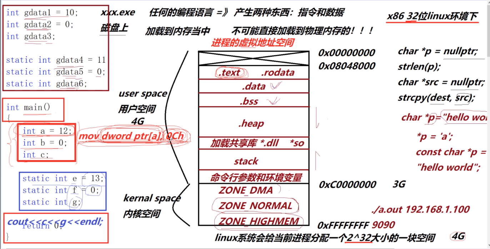

# C++

## $ 进程虚拟地址空间划分

- `.text`: 存放指令
- `.rodata`: read only data 只读数据段，存放字符串常量
- `.data`: 存放初始化后值不为零的变量
- `.bss`：存放未初始化或初始化后为0的变量
- `.heap`:
- `.stack`:
- 每一个进程的用户空间是私有的，但是内核空间是共享的
- 进程之间的通信方式之一：匿名管道通信（利用内核空间的共享区域）



## $ 函数的栈调用

- 参数压栈、函数栈帧的开辟和回退，存在着函数调用的开销
- 先把函数的参数压栈
- 调用函数前先把当前地址入栈
- 遇到函数的左括号，把main函数的栈帧ebp指针入栈，再为被调用的函数开辟新的栈帧，执行函数
- 遇到函数结束的右括号，释放申请的栈帧空间，出栈ebp，返回main函数的栈帧

## $ 基础

### $$ 形参带默认值的函数

1. 给默认值的时候，从右向左给
2. 调用效率的问题
3. 定义处可以给形参默认值，声明处也可以给形参默认值
4. 不管定义处给，还是声明处给，每个参数的默认值只能出现一次

### $$ 内联函数

- 函数代码简单短小，经常调用，就应该设置为内联函数

1. 与普通函数的区别
    在编译过程中，就没有函数的调用开销了，在调用处直接把函数的代码块复制过去替换，不再生成相应的函数符号。
2. 但是不是所有的inline都会被编译器处理成内联函数-递归
3. inline只是建议编译器把该函数处理成内联函数
4. debug版本上，inline不起作用，inline只有在release版本下才能出现

### $$ 函数重载

- 一组函数，函数名相同，但是参数列表的个数或者类型不同，那么这一组函数就称为函数重载。
- 一组函数要称得上是重载的话，必须是处在同一作用域下
- const或volatile的时候，是怎么影响形参类型的：顶层const不会改变形参类型，底层const会影响。
- 一组函数，函数名和参数列表都相同，仅仅是返回值不同，不叫重载。
- 请你解释一下什么叫多态
  - 静态（编译时期）的多态：函数重载就是之一，还有模板。。。
  - 动态（运行时期）的多态：

1. 为什么C++支持重载，C不支持
    因为C++产生函数符号的时候，是由函数名+参数列表类型来组成的；而C产生函数符号只由函数名来产生。总之就是编译器产生函数符号的规则不同。
2. 函数重载需要注意些什么
3. C++和C之间如何互相调用
    - C调用C++:也是无法直接调用，要把被调用的部分在C++源文件中用`extern "C" {函数定义}`括起来，这样这部分就会用C编译器编译，C可以直接调用了
    - C++调用C：无法直接调用，要用`extern "C" {C 函数的声明}`告诉编译器按照C编译器进行编译该处代码

### $$ const 指针 引用 在函数中的引用

1. const怎么理解？C和C++中的const区别？
    const修饰的变量不能再作为左值进行赋值！！！初始化完成后，值不能被修改！！  
    const的编译方式不同，C中，const就是当作一个变量来编译生成指令的；C++中，所有出现const常量名字的地方，都被常量的初始化替换掉了，编译期就完成了替换。  
    C中的const 修饰的量，可以不用初始化，所以C中const修饰的不叫常量，叫做常变量，可以通过指针等方式来修改，不能当做常量来使用  
    C++中的const必须初始化，且初始值是一个立即数，叫作常量；如果初始值不是一个立即数，那么就是一个常变量，是一个变量。

2. const和一级、多级指针的结合

    - const修饰的量常出现的错误是：
      - 常量不能再作为左值  <--- 可以直接修改常量的值
      - **不能把常量的地址泄露给一个普通的指针或普通的引用变量** <--- 可以间接修改常量的值
    - const与指针的类型转换：
      - `int* <= const int*`   是错误的
      - `const int* <= int*`   是正确的
      - 多级指针必须两边都有const才正确
      - `int** <= const int**` 是错误的
      - `const int** <= int**` 是错误的
      - `int** <= int*const*`  是错误的，是一级指针的转换:`* <= const*`
      - `int*const* <= int**`  是正确的，是一级指针的转换：`const* <= *`
      - **const如果右边没有指针*的话，const是不参与类型的**

3. 引用

- 引用是一种更加安全的、弱化的指针，是变量的别名

- 引用和指针的区别：
  - 引用必须初始化，指针可以不初始化
  - 定义一个引用变量，和定义一个指针变量，在汇编层面是一样的， 引用和指针的汇编代码一样；通过引用修改引用内存的值，和通过指针解引用修改指针所指向的内存的值，其底层汇编指令也是一样的。
  - 引用只有一级引用，没有多级引用；指针可以有一级指针，也可以有多级指针
  - 引用从一而终，始终代表了初始化的对象；指针可以更换指向的对象
  
  ```cpp
    int arary[5] = {1, 2, 3, 4, 5};
    int *p = array;
    // int (*q)[5] = &array; // 数组指针
    int (&q)[5] = array; // 对数组的引用
    sizeof(array); // 20
    sizeof(p); // 4
    sizeof(q); // 20
  ```

- 左值引用和右值引用
  - 左值：有内存具名的变量，值可以修改
  - 右值：没有内存，没名字
  - 右值引用：专门用来引用右值类型，指令上，可以自动产生临时变量，然后对该临时量进行引用；一个右值引用变量本身是一个左值,已经有内存具名了；`int &&c = 2; c = 3; int d = c;`；不能对左值进行右值引用。

### $$ new和delete

- new和delete，称作运算符
- malloc和free，称作C的库函数

- new和malloc, delete和free 的区别
  - malloc是按照字节来开辟内存，需要指定开辟多大字节数的内存，函数返回类型是void*, 需要进行转换为其他类型；`int *p = (int*)malloc(sizeof(int) * 5);`
  - 操作符new，通过直接指定类型来开辟内存，不用进行类型转换；new不仅可以做内存开辟，还可以做内存初始化操作。`int *p1 = new int[5]();`
  - 对于开辟内存失败的判断不一样：malloc开辟内存失败，是通过返回值和nullptr作比较；而new开辟内存失败，是通过抛出bad_alloc类型的异常来判断
  - new做两件事，一是分配内存，二是调用类的构造函数；同样，delete会调用类的析构函数和释放内存。而malloc和free只是分配和释放内存。
  - new建立的是一个对象，而malloc分配的是一块内存
  - new/delete是保留字，不需要头文件支持；malloc/free需要头文件库函数支持
  - new和delete配套使用，new[]和delete[]配套使用

- new有多少种
  
    ```cpp
    int *p1 = new int(20);      // 可以抛出异常的new
    int *p2 = new (nothrow) int;    // 不抛出异常的new
    const int *p3 = new const int(5);   // 申请存放常量类型空间的new
    定位new
    int data = 0;
    int *p4 = new (&data) int(50);
    ```

- new 和 delete可以混用吗？为什么要区分单个元素和数组的内存分配和释放呢？
  - 对于普通的内置类型，没有构造函数，new最后只是调用melloc进行单纯的内存分配，不涉及对象的构造和析构，所以此时`new/delete[]`、`new[]/delete`可以混用,但是最好不要
  - 对于自定义的类类型，有析构函数，为了正确调用析构函数，那么开辟对象数组的时候，会多开辟4个字节，记录对象的个数

## $ OOP面向对象

### $$ OOP编程  this指针

- OOP思想
  C: 各种各样函数的定义，struct  
  C++: 类 =》实体的抽象类型；  
  实体（属性、行为） =》 ADT(adstract data type);  
  对象（代表着实体） 《= （实例化）类（属性=》成员变量  行为=》成员方法）  
  属性一般是私有的成员变量，给外部提供公有的成员方法，来访问私有属性  

类不占用空间，对象才占用内存（栈或堆上构造对象）,对象占用内存的大小只与成员变量有关  
类内部实现的方法，自动处理为inline内联函数；类外定义的方法就是普通的方法，要想成为内联，必须要加上inlne  
**类可以定义无数的对象，每一个对象都有自己的成员变量，但是它们共享一套成员方法；调用成员方法时，都会自动加上一个this指针参数，把对象的地址传给成员方法，告诉成员方法是哪个具体对象的调用;** this指针就是用来区分当前类实例化的不同对象  

- OOP语言的四大特征
  抽象   封装/隐藏   继承   多态

### $$ 构造函数  析构函数

- 函数的名字和类名一样，没有返回值
- 构造函数可以带有参数，析构函数没有参数，所有构造函数可以有多个，叫做构造函数重载，而析构函数没有参数，只能有一个
- 不用手动调用，在定义对象时（先开辟内存，再调用构造函数），就会自动调用构造函数进行构造初始化，同理，在出了作用域或delete对象时，会自动调用析构函数来销毁对象（先调用析构函数，再释放内存）
- 析构函数可以手动调用，但是调用以后，对象的资源已经被释放了，只是把对象内部指针指向的内存释放掉，指针本身还没有释放，再调用成员函数的话，可能会对该指针进行操作，会造成内存的非法访问

- .data段上的对象：程序启动时构造，结束时析构
- heap段上的对象：new时构造，delete时析构
- stack段上的对象:进入了函数局部作用域时，遇到定义的地方构造，出了函数进行析构

### $$ 对象的浅拷贝和深拷贝

- 对象的默认拷贝构造是做内存的数据拷贝，不一定有错。但是，如果对象占用了外部的资源（比如说**对象中有指针指向了对象之外的外部资源** ，浅拷贝只会拷贝对象内部的数据，而不会为新对象内的指针开辟新的内存，这样多个指针就会指向同一块内存，这样当释放指针内存的时候，就会造成野指针，指向已经被释放了的内存），那么浅拷贝就错了。
- 所以**当类中有分配外部资源的时候（比如有指针），一定要重写拷贝构造、拷贝赋值和析构三个函数** ，避免浅拷贝。重写拷贝构造函数，把分配的外部资源也拷贝一份过来，不会造成野指针，各个指针指向自己的内存；重写拷贝赋值函数，当原对象赋值给另一个已存在对象后，要先把被赋值对象的空间给释放掉（避免内存泄露），再像拷贝构造那样开辟新的空间进行赋值。拷贝赋值与拷贝构造相比多一步对被赋值对象内存的释放，因为赋值是两个已经存在的对象之间进行。
- 拷贝赋值时一定要避免自我赋值，你想啊，赋值前要先释放被赋值对象的空间，你都把自己给释放了，还怎么进行赋值，所以一定要在拷贝赋值函数中检测是否进行了自我赋值（传入的参数==this?）,防止数据被删除
- 小结拷贝赋值函数过程：
  - 防止自我赋值
  - 释放被赋值对象的外部资源
  - 最后开辟内存进行赋值（类似于拷贝构造函数）

### $$ 手动实现一个自己的 string 类

- **对象的拷贝尽量不用memcpy和realloc** , 会造成浅拷贝，因为两个函数只是做内存的直接拷贝，不会把对象所占用的外部资源也拷贝，所以当对象成员变量中有指针的时候，会造成多个对象指向同一个外部资源，形成野指针。
- 迭代器的功能：提供一种统一的方式，来透明的遍历容器

```cpp
class MyString {
public:
  // 自定义了普通构造函数，就不会产生默认构造函数
  MyString(const char *str = nullptr) {
    if(str != nullptr) {  // 判断是否传入了空指针
      m_data = new char[strlen(str)+1]; // 开辟内存，strlen计算长度不带"\0"
      strcpy(this->m_data, str);  // 字符串复制过来
    } else {  // 如果传入的字符串指针为空，开辟一个字节空间，存放'\0'
      m_data = new char[1];
      *m_data = '\0';
    }
  }
  // 拷贝构造函数
  MyString(const MyString &other) {
    // 这里就不用判断other.m_data指针是否为空了，因为上面的构造函数保证了m_data一定指向一块内存，可以放心的进行复制
    m_data = new char[strlen(other.m_data)+1];
    strcpy(m_data, other.m_data);
  }  
  // 析构函数
  ~MyString() {
    delete[] m_data;
    m_data = nullptr; // 防止野指针出现
  }  
  // 重载赋值函数
  // 返回MyString& 是为了支持连续的operator= 操作
  MyString& operator=(const MyString &other){
    if(this == &other) return *this; // 自我赋值检测
    delete[] m_data;  // 把当前被赋值对象的所指向的内存给释放掉，避免内存泄露
    // 类似于拷贝构造，开辟内存，进行复制
    m_data = new char[strlen(other.m_data)+1];
    strcpy(m_data, other.m_data);
    return *this;
  }
  // >/>=/<=/</== 关系运算符重载函数
  bool operator>(const MyString& rhs)const {
    return strcmp(m_data, rhs.m_data)>0;
  }
  bool operator>=(const MyString& rhs)const {
    return !(strcmp(m_data, rhs.m_data)<0);
  }
  bool operator<=(const MyString& rhs)const {
    return !(strcmp(m_data, rhs.m_data)>0);
  }
  bool operator<(const MyString& rhs)const {
    return (strcmp(m_data, rhs.m_data)<0);
  }
  bool operator==(const MyString& rhs)const {
    return (strcmp(m_data, rhs.m_data)==0);
  }
  // size()函数，返回大小，不包括'\0'
  int size()const { return strlen(m_data); }
  // []操作符重载，支持随机访问
  char& operator[](int index) { return m_data[index]; }
  const char& operator[](int index)const { return m_data[index]; }
  // 返回C风格字符串，返回的是一个指针，指向一个由空字符结尾的字符数组
  // 指针的类型是const char*，确保不会改变字符数组的内容
  const char* c_str()const { return m_data; }

  // 给字符串类型提供迭代器的实现,指向的是容器底部元素的位置
  class iterator {
  public:
    iterator(char* p = nullptr) : _p(p) {}
    // 运算符重载: !=  前置++  提领*
    // 一般来说迭代器实现前置++就行了，不会产生临时量，直接返回
    bool operator!=(const iterator& it) {return _p != it._p;}
    void operator++() {++_p;}
    char& operator*() {return *_p;}
  private:
    char* _p;
  }
  // begin返回容器底层首元素的迭代器,end返回容器最末元素后继位置的迭代器
  // 注意begin和end都是MyString的方法，而不是迭代器的方法
  iterator begin() {return iterator(m_data);}
  iterator end() {return iterator(m_data + size());}

private:
  char *m_data; //用于保存字符串
  friend ostream& operator<<(ostream& out, const MyString& rhs);
  friend MyString operator+(const MyString& lhs, const MyString& rhs);
};

// +运算符重载函数  要写在全局作用域
MyString operator+(const MyString& lhs, const MyString& rhs) {
  // 需要开辟足够的内存空间来存放拼接后的字符串
  MyString tmp; // 出了作用域，tmp会自动被析构，释放内存
  tmp.m_data = new char[strlen(lhs.m_data) + strlen(rhs.m_data) +1];
  strcpy(tmp.m_data, lhs.m_data);
  strcat(tmp.m_data, rhs.m_data);
  return tmp;
}
// <<输出流运算符重载
ostream& operator<<(ostream& out, const MyString& rhs) {
  out << rhs.m_data;
  return out;
}

int main() {
  // 调用普通构造函数
  MyString str1;
  MyString str2("hello");
  MyString str3 = "world";

  // 调用拷贝构造函数
  MyString str4 = str3;
  MyString str5(str3);

  // 调用重载赋值函数
  /*
  str1 = str2
  str1.operator=(str2) ----> MyString& str1
  str3 = str1
  */
  str3 = str1 = str2;

  return 0;
}
```

### $$ 构造函数初始化列表

- 构造函数初始化列表可以指定成员变量的初始化方式
- 成员变量的初始化和它们定义的顺序有关，和构造函数初始化列表中出现的先后顺序无关。

### $$ 类的成员方法/变量

- **核心就是this指针**

1. 普通成员方法 =》 编译器会添加一个`class*this`形参变量
   - 属于类的作用域
   - 调用依赖一个对象（常对象是无法调用的 实参：`const class*`, 而普通成员方法的形参：`class*`）
   - 可以任意访问对象的私有成员
2. 静态成员方法 =》 不会生成this指针形参
   - 普通成员方法有this指针，**静态成员方法没有this指针** ，所以不需要通过对象来访问，直接用类名作用域来访问`class::静态方法`，也因此静态成员方法只能访问静态成员
   - 类中的静态成员变量/方法，属于类，而不属于某一个对象，为所有对象所共有
   - 类中的静态成员变量，必须类中声明，类外定义
3. 常成员方法 =》 生成一个`const class* this`指针的形参
   - 只要是只读操作的成员方法，一律实现为const常成员方法
   - 属于类的作用域，调用依赖一个对象、普通对象或常对象都可以
   - 可以任意访问对象的私有成员，但是只能读， 不能写

### $$ 指向类成员（成员方法、成员变量）的指针

- 指向类成员变量的指针：要加类的作用域，通过实例化的对象来调用
- 指向类成员方法的指针：要加类的作用域，通过实例化的对象来调用
- 指向类静态成员变量/方法的指针：只要加类的作用域

```cpp
// 指向类成员变量的指针
int Test::*p = &Test::data;
t1.*p = 10;
t2->*p = 20;
// 指向类成员方法的指针
void (Test::*pfun)() = &Test::show;
(t1.*pfun)();
(t2->*pfun)();
// 指向类静态成员变量/方法的指针
int Test::*p = &Test::count;
cout << *p;
```

## $ 模板编程

### $$ 函数模板

- 模板的意义：对类型也可以进行参数化了
- 模板的实参推演：如果用户没有指定类型参数，编译器可以根据用户传入的实参类型，来推导出模板类型
- 模板的非类型参数：必须是整数类型（整数或地址/引用都可以）都是常量，只能使用，而不能修改
- **函数模板** 是不会进行编译的，因为编译器不知道模板参数的具体类型，只有在调用点指明了参数类型后（或者经过模板的实参推演），才能从原模板进行实例化，编译为具体的**模板函数**。
  - 函数模板：不编译，因为类型还不知道
  - 模板的实例化：函数调用点进行实例化
  - 模板函数：才是被编译器所编译的
- 模板特例化：特殊的实例化（不是编译器提供的,而是用户提供的）
  - 对于某些类型来说，依赖编译器默认实例化的模板函数，代码处理逻辑是错误的，所以用户要提供特定类型的模板函数。常见的就是字符串类型，需要特殊处理
- 函数模板、模板的特例化、非模板函数（普通函数）它们不是重载关系，因为模板特例化的函数名字与其他的不一样
- 模板代码是不能在一个文件中定义，在另外一个文件中使用的。模板代码在调用之前，一定要看到模板定义的地方，这样，模板才能进行正常的实例化，产生能够被编译器编译的代码。**所以，模板代码一般都是放在头文件中的，然后在源文件中进行#include包含**

### $$ 类模板

- 类模板 =》 实例化 =》 模板类
- 模板名称 + 类型参数列表 = 类名称
- 构造、析构函数的`<T>` 可以省略

手写一个简单的vector:

- 容器的构造应该把开辟内存和构造对象分开
- 容器的删除元素，应该只需要析构对象，而不要释放内存
- 所以容器的开发中，不能直接使用new和delete
- 容器的空间配置器allocator做四件事：内存开辟/内存释放   对象构造/对象析构

```cpp
template<typename T>
class vector {
public:
  vector(int size = 10) { // 普通构造函数
    _first = new T[10]; // new即开辟内存，又构造了对象，最好把开辟内存和构造对象分开
    _last = _first;
    _end = _first + size;
  }
  ~vector() {     // 析构函数
    delete[] _first;
    _first = _last = _end = nullptr;
  }
  // 拷贝构造函数
  vector(const vector<T>& rhs) {
    int size = rhs._end - rhs._first;
    int len = rhs._last - rhs._first;
    _first = new T[size];
    _last = _first + len;
    _end = _first + size;
    // 元素拷贝过来
    for(int i=0; i<len; i++) _first[i] = rhs._first[i];
  }
  // 赋值操作函数，可以连续赋值
  vector<T>& operator=(const vector<T>& rhs) {
    // 防止自我赋值
    if(this == rhs) return *this;
    // 释放被赋值对象申请的内存
    delete[] _first;
    // 拷贝构造
    int size = rhs._end - rhs._first;
    _first = new T[size];
    int len = rhs._last - rhs._first;
    for(int i=0; i<len; i++) _first[i] = rhs._first[i];
    _last = _first + len;
    _end = _first + size;

    return *this;
  }

  void push_back(const T& val) {
    if(full()) expand();
    *_last++ = val;
  }
  void pop_back() {
    if(empty()) return;
    _last--;
  }
  T back() const {
    return *(_last-1);
  }
  bool full() const { return _last == _end; }
  bool empty() const { return _last == _first; }
  int size() const { return _last - _first; }
private:
  T *_first;  // 指向数组的起始位置
  T *_last;   // 指向数组中有效元素的后继位置
  T *_end；   // 指向数组空间的后继位置
  // 容器的二倍扩容
  void expand() {
    int size = _end - _first;
    T* ptmp = new T[2 * size];
    for(int i=0; i<size; i++) ptmp[i] = _first[i];
    delete[] _first;
    _first = ptmp, _last = _first + size, _end = _first + 2*szie;
  }
};
```

```cpp
// 加入空间配置器
// 定义容器的空间配置器，和C++标准库的allocator实现一样
template<typename T>
class Allocator {
  // 负责内存开辟
  T* allocate(size_t size) return (T*)malloc(sizeoof(T) * size);
  // 负责内存释放
  void deallocate(void* p) free(p);
  // 负责对象构造
  void construct(T* p, const T& val) new (p) T(val);  // 定位new
  // 负责对象析构
  void destroy(T *p) p->T(); // ~T()代表T类型的析构函数
}

// 带有空间配置器的vector
template<typename T, typename Alloc = Allocator<int>>
class vector {
public:
  vector(int size = 10) {
    _first = _allocator.allocate(size); // 开辟内存
    _last = _first;
    _end = _first + size;
  }
  ~vector() {
    for(T* p=_first; p!=_last; p++) _allocator.destroy(p); // 析构容器有效元素
    _allocator.deallocate(_first);// 然后释放_first指针指向的堆内存
    _first = _last = _end = nullptr;
  }
  vector(const vector<T>& rhs) {
    int size = rhs._end - rhs._first;
    int len = rhs._last - rhs._first;
    _first = _allocator.allocate(size);
    _last = _first + len;
    _end = _first + size;

    for(int i=0; i<len; i++) _allocator.consttruct(_first+i, rhs._first[i]);
  }
  
  vector<T>& operator=(const vector<T>& rhs) {

    if(this == rhs) return *this;

    // delete[] _first;
    for(T* p=_first; p!=_last; p++) _allocator.destroy(p); // 析构容器有效元素
    _allocator.deallocate(_first);// 然后释放_first指针指向的堆内存

    int size = rhs._end - rhs._first;
    // _first = new T[size];
    _first = _allocator.allocate(size); // 开辟内存
    int len = rhs._last - rhs._first;
    // for(int i=0; i<len; i++) _first[i] = rhs._first[i];
    for(int i=0; i<len; i++) _allocator.consttruct(_first+i, rhs._first[i]);
    _last = _first + len;
    _end = _first + size;

    return *this;
  }

  void push_back(const T& val) {
    if(full()) expand();
    // *_last++ = val;
    // _last 指针指向的内存构造一个值为val的对象
    _allocator.construct(_last, val);
    _last++;
  }
  void pop_back() {
    if(empty()) return;
    //_last--;
    // 不仅要把_last指针--, 还需要析构删除元素
    _last--;
    _allocator.destroy(_last);
  }
  T back() const {
    return *(_last-1);
  }
  bool full() const { return _last == _end; }
  bool empty() const { return _last == _first; }
  int size() const { return _last - _first; }

  // 运算符重载
  T& operator[](int index) {
    if(index<0 || index>=size()) throw "OutOfRangeException";
    return _first[index];
    }

  // 迭代器一般实现成容器的嵌套类型
  class iterator {
  public:
    iterator(const T* p) : _p(p) {}
    // 运算符重载
    bool operator!=(const iterator& rhs)const {return _p != rhs._p;}
    void operator++() {return ++_p;}
    T& operator*() {return *_p;}
    const T& operator*()const {return *_p;}
  private:
    T* _p;
  }
  iterator begin() {return iterator(_first);}
  iterator end() {return iterator(_last);}
private:
  T *_first;  // 指向数组的起始位置
  T *_last;   // 指向数组中有效元素的后继位置
  T *_end；   // 指向数组空间的后继位置
  Alloc _aloocator; // 定义容器的空间配置器对象
  // 容器的二倍扩容
  void expand() {
    int size = _end - _first;
    // T* ptmp = new T[2 * size];
    T* ptmp = _allocator.allocate(2*size);
    // for(int i=0; i<size; i++) ptmp[i] = _first[i];
    for(int i=0; i<size; i++) _allocator.construct(ptmp+i, _first[i]);
    // delete[] _first;
    for(T *p = _first; p!=-last; ++p) _allocator.destroy(p);
    _allocator.deallocate(_first);
    _first = ptmp, _last = _first + size, _end = _first + 2*szie;
  }
};
```

## $ 运算符重载

- 使对象的运算表现得和编译器内置类型一样
- 本质上是对象对成员方法的调用，运算符左边是调用操作符的对象，右边是运算符重载函数的参数
- 编译器做对象运算的时候，会调用对象的运算符重载函数（优先调用成员方法）；如果没有成员方法，就在全局作用域找合适的运算符重载函数。
- ++、--：是单目运算符，`operator++()`前置++， `operator++(int)`带有整型参数的是后置++

### $$ 容器的迭代器

- 迭代器的功能：提供一种统一的方式，来透明的遍历容器.一般都要实现`运算符重载: !=  前置++  提领*`
- iterator -> 遍历所有容器 -> 方式都是一样的

  ```cpp
  auto it = container.begin();
  for(; it != container.end(); ++it) cout << *it << endl;
  ```

- 泛型算法 -> 给所有容器都可以使用的， 参数接收的都是容器的迭代器

### $$ 迭代器的失效问题

- C++primer 9.3.6
- 迭代器为什么会失效
  - 当容器调用`erase` 方法后，当前位置到容器末尾位置的所有迭代器全部失效
  - 当容器调用`insert`方法后，当前位置到容器末尾位置的所有迭代器全部失效
  >迭代器依然有效:[首元素， 插入点/删除点]
  >迭代器全部失效:[插入点/删除点， 末尾元素]
  - 对于`insert`来说， 如果引起了容器扩容，那么原容器的所有迭代器全部失效
- 问题怎么解决
  - 对插入/删除点的迭代器进行更新操作