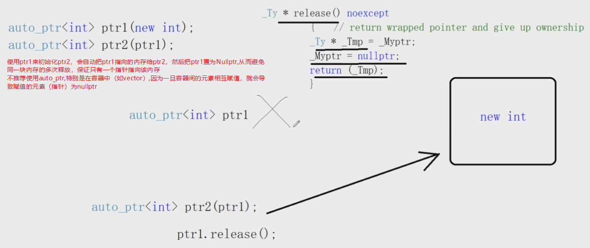
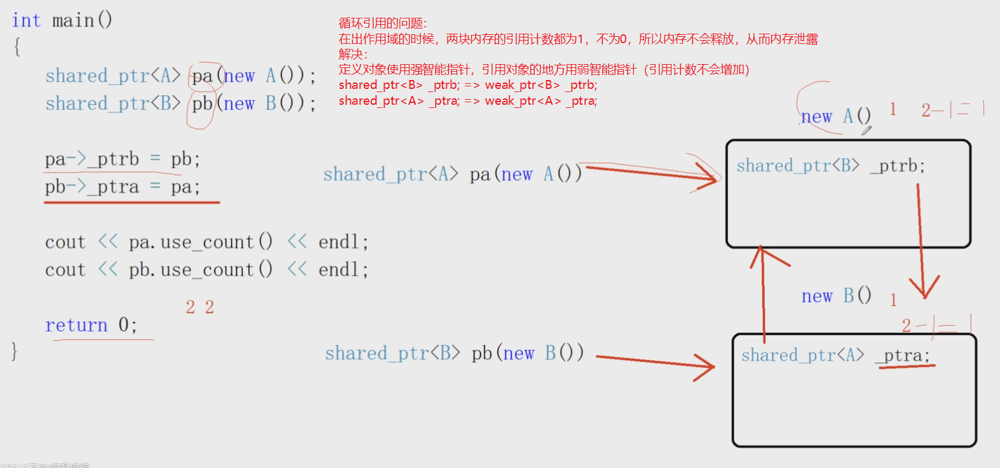

# 高级部分

## 一 对象的应用优化、右值引用的优化

1. 临时对象的生命周期：所在语句
 C++编译器对于对象构造的优化：用临时对象生成新对象的时候，临时对象就不产生了，直接构造新对象就可以了

2. 不能返回局部的或者临时对象的指针或引用：
    1. 函数参数传递过程中，对象优先按引用传递，不要按值传递
    2. 函数返回对象的时候，应该优先返回一个临时对象（这样会少调用一次拷贝构造和析构），而不要返回一个定义过的对象
    3. 接收返回值是对象的函数调用的时候，优先按初始化的方式接收，不要按赋值的方式接收

## 二 智能指针

- 智能指针：本质是一个模板类，保证能做到资源的自动释放。它将裸指针封装为一个栈上的对象，利用栈上的对象出作用域会自动析构的特征，来做到资源的自动释放
- 裸指针：需要手动释放资源，new~delete
- 实现一个简单的智能指针：

```cpp
template<typename T>
class smartPtr {
public:
    smartPtr(T *ptr = nullptr) : mptr(ptr) {}
    ~smartPtr() {delete mptr;}
    // 指针的*和->运算符重载
    T& operator*() {return *mptr;}  // 返回引用才能改变指向的内存
    T* operator->() {return mptr;}
private:
    T *mptr;
}

int main() {
    // int *p = new int;
    // 一旦出了作用域，指针会自动释放资源
    smartPtr<int> p(new int);
}
```

### 2.1 不带引用计数的指针指针

- C++标准库<memset>: auto_ptr
- C++11<memory>: scoped_ptr/unique_ptr

1. auto_ptr

    - 处理浅拷贝问题：拷贝构造过程中， 永远只让最后一个指针指向该内存， 前面的指针全部置空（就等于是转让所有权了）
    - 所以不推荐使用auto_ptr，特别是最好别在容器中使用
    

2. scoped_ptr: 禁止使用拷贝构造和赋值操作符函数了，仅仅只能使用单个的对象，使用较少
3. unique_ptr: 推荐使用。也是不能进行拷贝构造
    - 独占式拥有，保证同一时间内只有一个智能指针可以指向该对象（**不允许赋值和拷贝操作，只能够移动**）。
    - 提供了右值的拷贝和赋值操作函数，可以用`std::move()`移动语义获得对象的右值引用，然后转让所有权（调用移动拷贝构造函数）
    - 移动语义：通过移动而不是复制来避免无必要的资源浪费。unique_ptr内部实现了移动拷贝构造函数

    ```cpp
    #include <iostream>
    #include <memory>

    int main() {
        {
            std::unique_ptr<int> p1(new int(10));  //绑定动态对象
            //std::unique_ptr<int> p2 = p1;  //不能賦值
            //std::unique_ptr<int> p2(p1);  //不能拷貝
            std::unique_ptr<int> p2 = std::move(p1); //轉換所有權
            std::unique_ptr<int> p3(std::move(p2));
            p2.release(); //释放所有权
        }
        //超過p1/p2的作用域，內存釋放
    }
    ```

### 2.2 带引用计数的智能指针

- shared_ptr/weak_ptr
- 多个智能指针可以管理同一个资源
- 带引用计数：给每一个对象资源，匹配一个引用计数
- 智能指针 -》资源的时候 -》 引用计数+1
- 智能指针 -》不使用资源的时候 -》引用计数-1 -》计数为0时，释放所指向的内存

1. shared_ptr: 强智能指针， 可以改变资源的引用计数
    - **弱智能指针观察强智能指针，强智能指针操作资源**
    - 循环引用的问题：造成new出来的资源无法释放，资源泄露
    - 定义对象的时候，用强智能指针；引用对象的地方，用弱智能指针

    ```cpp
    class B;
    class A {
    public:
        A() {}
        ~A() {}
        shared_ptr<B> ptrb;     // weak_ptr<B> ptrb;
    };
    class B {
        B() {}
        ~B() {}
        shared_ptr<A> ptra;     // weak_ptr<A> ptra;
    };

    int main() {
        shared_ptr<A> pa(new A());
        shared_ptr<B> pb(new B());
        // 循环引用了，即使出了作用域，对象也不会被释放掉，引用计数都为2了
        pa->ptrb = pb;
        pb->ptra = pa;
    }
    ```

    

2. weak_ptr: 弱智能指针， 不会改变资源的引用计数
    - 解决强智能指针的循环引用的问题，循环引用导致内存永远不会被释放，造成内存泄漏。
    - 总之，弱智能指针只能观察资源（观察资源的引用计数），而不能使用资源。
    - 使用资源时必须要通过成员函数`lock()`方法（也称提升方法），提升后转变为强智能智能（前提是提升时，资源还存在，没有被释放，否则返回空指针），同时引用计数+1

### 2.3 多线程访问共享对象的线程安全问题

### 2.4 智能指针的删除器


## 三 绑定器和函数对象、lambda表达式

- 绑定器是函数对象的一个应用
- 绑定器 + 二元函数对象 =》 一元函数对象

1. C++ STL中的绑定器  
bind1st : operator()的第一个形参变量绑定成一个确定的值
bind2nd : operator()的第二个形参变量绑定成一个确定的值

2. C++11从Boost库中引入了bind绑定器和function函数对象机制

**std::function:**  

- function：称作**多态函数包装器** ,可以对调用对象进行封装
- 可以用作**回调函数**
- function的原理：

    ```cpp
    // 模板泛化
    template<typename Fty>
    class myfunction {};
    // 模板特化，typename...模板参数包，表示参数有多个
    template<typename R, typename... A>
    class myfunction<R(A...)>
    {
    public:
        using PFUNC = R(*)(A...);
        myfunction(PFUNC pfunc) :_pfunc(pfunc) {}
        R operator()(A... arg)
        {
            return _pfunc(arg...);
        }
    private:
        PFUNC _pfunc;
    };


    void hello(string str) { cout << str << endl; }
    int sum(int a, int b) { return a + b; }
    int main()
    {
        function<void(string)> func1(hello);
        func1("hello world!");

        myfunction<int(int, int)> func2(sum);
        cout << func2(10, 20) << endl;

        return 0;
    }
    ```

**std::bind:**

- **bind绑定器：**bind本身是一个**函数模板** ，可以自动推演模板类型参数。结果返回一个**函数对象**
- 绑定后的结果使用`std::function`进行保存，在我们需要的时候在进行调用，是一种延迟计算的思想。

**作用：**

- 将可调用对象与参数一起绑定供另一个std::function调用
- 将n元可调用对象转成m(m < n)元可调用对象，**绑定一部分参数**，这里需要使用std::placeholders

3. lambda表达式：底层依赖函数对象的机制实现的

- lambda表达式的语法：`[捕获外部变量](形参列表)->返回值{操作代码};`
- 如果lambda表达式的返回值不需要，那么"->返回值"可以省略的，也可以自动推导
- [捕获外部变量]:
    - []：表示不捕获任何外部变量
    - [=]：以传值的方式捕获外部的所有变量
    - [&]：以传引用的方式捕获外部的所有变量
    - [this]：捕获外部的this指针
    - [=,&a]：以传值的方式捕获外部的所有变量，但是a变量以传引用的方式捕获
    - [a, b]：以值传递的方式捕获外部变量a和b
    - [a, &b]：a以值传递捕获，b以传引用的方式捕获

- 注意：既然lambda表达式只能使用在语句当中，如果想跨语句使用之前定义好的lambda表达式，
怎么办？用什么类型来表示lambda表达式？  
- 当然是用function类型来表示函数对象的类型了   bind1st/bind2nd bind绑定器   本质上都是函数对象。

## 四 C++11内容汇总、多线程应用实践

- 关键字和语法

```cpp
auto：可以根据右值，推导出右值的类型，然后左边变量的类型也就已知了
nullptr：给指针专用（能够和整数进行区别） #define NULL 0
foreach：可以遍历数组，容器等
for(Type val : container) => 底层就是通过指针或者迭代器来实现的
{
}
```

- 右值引用：move移动语义函数和forward类型完美转发函数
模板的一个新特性：typename... A  表示可变参（类型参数）

- 绑定器和函数对象
function：函数对象
bind：绑定器  bind1st和bind2nd+二元函数对象 =》 一元函数对象
lambda表达式

- 智能指针
shared_ptr和weak_ptr

- 容器
set和map：红黑树 O(lgn)
unordered_set和unordered_map：哈希表 O(1)
array：数组   vector
forward_list：前向链表   list

- C++语言级别支持的多线程编程
createThread
pthread_create
clone

### 4.1 多线程

C++语言级别的多线程编程=》代码可以跨平台 windows/linux/mac  
thread/mutex/condition_variable  
互斥锁：lock_quard/unique_lock  
atomic 原子类型 基于CAS操作的原子类型 线程安全的  
sleep_for

   C++语言层面 thread
   windows        linux  strace ./a.out
      |             |
createThread    pthread_create

**线程内容：**  

1. 怎么创建启动一个线程
`std::thread`定义一个线程对象，传入线程所需要的线程函数和参数，线程自动开启

2. 子线程如何结束
子线程函数运行完成，线程就结束了

3. 主线程如何处理子线程
    - t.join() : 等待t线程结束，当前线程继续往下运行
    - t.detach() : 把t线程设置为分离线程，主线程结束，整个进程结束，所有子线程都自动结束了！

### 4.2 线程间的互斥

- 线程间的互斥 =》 互斥锁mutex =》 lock_guard封装mutex：保证所有线程都能释放锁，防止死锁问题的发生
- 竞态条件：多线程程序执行的结果是一致的，不会随着CPU对线程不同的调用顺序，而产生不同的运行结果。

### 4.3 线程间的同步通信机制

**多线程编程的两个问题：**

- 线程间的互斥
竟态条件 =》 临界区代码段 =》 保证原子操作 =》互斥锁mutex  轻量级的无锁实现CAS
strace ./a.out mutex => pthread_mutex_t
- 线程间的同步通信
生产者，消费者线程模型

```cpp

#include "pch.h"
#include <iostream>
#include <thread>
#include <mutex>
#include <condition_variable>
#include <queue> // C++ STL所有的容器都不是线程安全
using namespace std;

std::mutex mtx; // 定义互斥锁，做线程间的互斥操作
std::condition_variable cv; // 定义条件变量，做线程间的同步通信操作

// 生产者生产一个物品，通知消费者消费一个；消费完了，消费者再通知生产者继续生产物品
class Queue
{
public:
    void put(int val) // 生产物品
    {
        //lock_guard<std::mutex> guard(mtx); // scoped_ptr
        unique_lock<std::mutex> lck(mtx); // unique_ptr
        while (!que.empty())
        {
            // que不为空，生产者应该通知消费者去消费，消费完了，再继续生产
            // 生产者线程进入#1等待状态，并且#2把mtx互斥锁释放掉
            cv.wait(lck);  // lck.lock()  lck.unlock
        }
        que.push(val);
        /*
        notify_one:通知另外的一个线程的
        notify_all:通知其它所有线程的
        通知其它所有的线程，我生产了一个物品，你们赶紧消费吧
        其它线程得到该通知，就会从等待状态 =》 阻塞状态 =》 获取互斥锁才能继续执行
        */
        cv.notify_all(); 
        cout << "生产者 生产:" << val << "号物品" << endl;
    }
    int get() // 消费物品
    {
        //lock_guard<std::mutex> guard(mtx); // scoped_ptr
        unique_lock<std::mutex> lck(mtx); // unique_ptr
        while (que.empty())
        {
            // 消费者线程发现que是空的，通知生产者线程先生产物品
            // #1 进入等待状态 # 把互斥锁mutex释放
            cv.wait(lck);
        }
        int val = que.front();
        que.pop();
        cv.notify_all(); // 通知其它线程我消费完了，赶紧生产吧
        cout << "消费者 消费:" << val << "号物品" << endl;
        return val;
    }
private:
    queue<int> que;
};

void producer(Queue *que) // 生产者线程
{
    for (int i = 1; i <= 10; ++i)
    {
        que->put(i);
        std::this_thread::sleep_for(std::chrono::milliseconds(100));
    }
}
void consumer(Queue *que) // 消费者线程
{
    for (int i = 1; i <= 10; ++i)
    {
        que->get();
        std::this_thread::sleep_for(std::chrono::milliseconds(100));
    }
}
int main()
{
    Queue que; // 两个线程共享的队列

    std::thread t1(producer, &que);
    std::thread t2(consumer, &que);

    t1.join();
    t2.join();

    return 0;
}
```

**lock_guard和unique_lock：**

- lock_guard:不能用在函数参数传递或者返回过程中，只能用在简单的临界区代码段的互斥操作中
- unique_lock:不仅可以使用在简单的临界区代码段的互斥操作中，还能用在函数调用过程中

**condition_variable  wait和notify_all方法:**

- cv.wait(mtx):#1.使线程进入等待状态   #2.lck.unlock可以把mtx给释放掉
- cv.notify_all():通知在cv上等待的线程，条件成立了，起来干活了！
其它在cv上等待的线程，收到通知，从等待状态 =》 阻塞状态 =》 获取互斥锁了 =》线程继续往下执行

```cpp
std::mutex mtx; // pthread_mutex_t
std::condition_variable cv; // pthread_condition_t
int main()
{
    /*
    通知在cv上等待的线程，条件成立了，起来干活了！
    其它在cv上等待的线程，收到通知，从等待状态 =》 阻塞状态 =》 获取互斥锁了 =》线程继续往下执行
    */
    cv.notify_all();

    // 它不仅可以使用在简单的临界区代码段的互斥操作中，还能用在函数调用过程中
    //unique_lock<std::mutex> lck(mtx);
    //cv.wait(lck); // => #1.使线程进入等待状态 #2.lck.unlock可以把mtx给释放掉

    //不可能用在函数参数传递或者返回过程中，只能用在简单的临界区代码段的互斥操作中
    //lock_guard<std::mutex> guard(mtx); 

    //mtx.lock();
    //mtx.unlock();

    return 0;
}
```

### 4.4 原子类型

- 头文件`<atomic>`：包含了很多原子类型

## 五 设计模式

