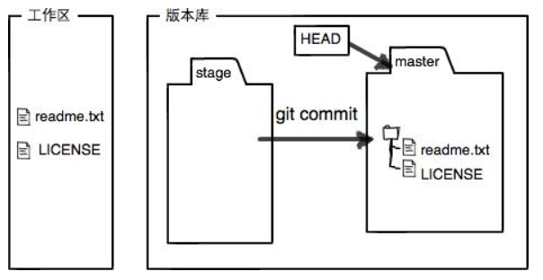

Git教程
======
## 一.简介与安装、创建版本库
&emsp;Git是一个用C语言写的一个分布式版本控制系统。
&emsp;版本控制系统对比：

>集中式|分布式
>-|-
>版本库存放于中央服务器，各个客户端从中央服务器获得最新的版本，完成工作后再把最新完成的版本推送给中央服务器。工作时必须联网。|没有中央服务器，每个客户端上都是一个完整的版本库。无须联网，各个客户端之间互相推送自己所做的修改。
&emsp;Git作为分布式相对于集中式的好处在于：
>·自己可以在脱机环境查看开发的版本历史 
>·多人开发时如果充当中央仓库的Git仓库挂了，任何一个开发者的仓库都可以作为中央仓库进行服务

1.Git安装:

```linux
	sudo apt-get install git
	git config --global user.name "Your Name"
	git config --global user.email "email@example.com"
```
2.创建版本库(repository)：

```
	mkdir learngit
	cd learngit
	pwd
```

初始化，让这个目录变成Git可以管理的仓库：
>`git init`
>`当前目录下多了一个.git的目录，这个目录是Git来跟踪管理版本库的，没事千万不要手动修改这个目录里面的文件`

添加文件到Git仓库，分两步：

>使用命令`git add <file>`，注意，可反复多次使用，添加多个文件；
>使用命令`git commit -m "message"`，完成。

## 二.时光穿梭
>`git status`：查看当前仓库的状态，处于哪个分支，修改了什么文件，是否提交了修改。
>`git diff filename`：查看difference，显示的格式正是Unix通用的diff格式。

### 1.版本回退
>`git log`：显示从最近到最远的提交日志，包含了每个提交版本对应的commit-id信息。
>`git log --pretty=oneline`：简略的显示日志信息。

Git内部有一个指向当前版本的`HEAD`指针，当你回退版本的时候，Git仅仅只是修改`HEAD`指针的指向，然后顺便把工作区的文件更新了。
在Git中，用`HEAD`表示当前版本，上一个版本是`HEAD^`，上上一个版本是`HEAD^^`，往前的第n个版本是`HEAD~n`。

>`git reset --hard HEAD^`：回退至上一个版本。
>`git reset --hard commit-id`：回退至指定的那个版本。

**小结：**

>* `HEAD`指向的版本就是当前版本，因此，Git允许我们在版本的历史之间穿梭，穿梭命令为`git reset --hard commit-id`。
>* 穿梭之前，用`git log`来查看提交历史，以便确定要回退至哪一个版本。
>* 穿梭之后还想重返未来，用`git reflog`查看命令历史，以便确定要回到未来的哪一个版本。

### 2.工作区和暂存区
* 工作区（Working Directory）：只你电脑里能够看见的目录，你在那个目录里对文件进行修改等一系列操作。
* 版本库（Repository）：工作区有一个隐藏目录`.git`，这不算工作区，而是Git的版本库。版本库主要包含了暂存区（Stage）、Git为我们自动创建的第一个分支master、以及指向master的一个指针HEAD。
>`git add`命令把提交的所有修改存放到暂存区；
>
>然后，`git commit`命令一次性把暂存区的所有修改提交到分支。提交完了之后，暂存区就没有任何内容了。
>

### 3.管理修改
>`git diff HEAD -- filename`：可以查看工作区和版本库里最新版本的区别。
>注意每修改一次就提交一次：第一次修改->`git add`->第二次修改->`git add`->多次修改就多次`add`->`git commit`多次修改最后一并提交至分支。
>每次修改如果不用`git add`到暂存区，那么`git commit`就不会把那次修改提交至分支上。

### 4.撤销修改
>`git checkout -- filename`：撤销filename在工作区的修改。这里对应两种情况：
>>* 一种是该文件修改后还没有提交到暂存区，此时，撤销修改就会回到和版本库一模一样的状态；
>>* 另一种是该文件已经添加至暂存区了，又做了修改，此时，撤销修改就会回到添加暂存区后的状态。
>>总之，就是让这个文件回到最近一次`git commit`或`git add`时的状态。

>`git reset HEAD filename`：把暂存区的修改撤销掉（unstage），重新放回工作区。`git rest`命令既可以回退版本，也可以把暂存区的修改回退至工作区。当我们用`HEAD`时，表示最新版本。

**小结：**
- 场景一：当你想直接丢弃工作区的修改时（还没有`git add`和`git commit`之前），用命令`git checkout -- filename`，从暂存区来恢复工作区。
- 场景二：当你不但修改了工作区某个文件的内容，还添加到了暂存区时（`git add`或`git rm`以后），想丢弃修改那就要分两步：
>第一步：使用命令`git reset HEAD filename`回到场景一，从版本库来恢复暂存区；
>第二步：按场景一操作。

- 场景三：已经提交了不合适的修改到版本库时（`git add`和`git commit`之后），想要撤销本次提交，参考版本回退一节，使用`git reset --hard commit-id`命令，不过前提是没有推送至远程库。

### 5.删除文件
在Git中，删除其实也是一种修改操作。

- `rm filename`：只是删除了工作区的文件。如果想要恢复，直接用`git checkout -- filename`从暂存区来恢复工作区。
- `git rm filename`：不仅删除了工作区的文件，还把删除的操作提交至了暂存区。如果想要恢复，先用命令`git reset HEAD filename`从版本库来恢复暂存区，再用命令`git checkout -- filename`从暂存区来恢复工作区。
>sp：此处直接使用命令`git checkout HEAD -- filename`从版本库来进行恢复工作区也是可以的。

- `git rm filename`+`git commit`：彻底把版本库里的文件也删掉。想要恢复的话，先使用命令`git reset --hard commit-id`版本回退。

## 三.远程仓库
在本地Git仓库和Github仓库之间的传输是通过SSh加密传输的：
>1. 创建SSH Key。在用户主目录下，看看有没有.ssh目录，如果有，再看看这个目录下有没有id_rsa和id_rsa.pub这两个文件，如果已经有了，可直接跳到下一步。如果没有，打开Shell（Windows下打开Git Bash），创建SSH Key：$ ssh-keygen -t rsa -C "youremail@example.com"
>2. 登陆GitHub，打开“Account settings”，“SSH Keys”页面：然后，点“Add SSH Key”，填上任意Title，在Key文本框里粘贴id_rsa.pub文件的内容.

### 1.从本地添加远程库
在github上创建一个远程仓库learngit，并把自己笔记本上一个已有的本地仓库learngit与之关联，然后把本地仓库的内容推送到github仓库。
```linux
git remote add origin git@github.com:lxj1996/learngit.git
添加后，远程库的名字就是origin，这是 Git 默认的叫法，也可以改成别的，但是origin这个名字一看就知道是远程库。
```
```linux
git push -u origin master
把本地库的内容推送到远程，用git push命令，实际上是把当前分支master推送到远程。
```

由于远程库是空的，我们第一次推送`master`分支时，加上了`-u`参数，Git 不但会把本地的`master`分支内容推送的远程新的`master`分支，还会把本地的`master`分支和远程的`master`分支关联起来，在以后的推送或者拉取时就可以简化命令。
**小结:**

- 要关联一个远程库，使用命令`git remote add origin git@server-name:path/repo-name.git`；
- 关联后，使用命令`git push -u origin master`第一次推送 master 分支的所有内容；
- 此后，每次本地提交后，只要有必要，就可以使用命令`git push origin master`推送最新修改.
### 2.从远程库克隆到本地
要克隆一个仓库，首先必须知道仓库的地址，然后使用git clone命令克隆。
>比如说，创建一个新的远程仓库，名叫gitskills，勾选Initialize this repository with a README，这样 GitHub 会自动为我们创建一个README.md文件。创建完毕后，可以看到README.md文件。
>下一步是用命令git clone克隆一个本地库：`git clone git@github.com:lxj1996/gitskills.git`
注意：Git 支持多种协议，包括https，但通过ssh支持的原生git协议速度最快。

## 四.分支管理
### 1.创建与合并分支
- 查看分支：`git branch`
- 创建分支：`git branch <name>`
- 切换分支：`git checkout <name>`或者`git switch <name>`
- 创建+切换分支：`git checkout -b <name>`或者`git switch -c <name>`
- 合并某分支到当前分支：`git merge <name>`
- 删除分支：`git branch -d <name>`
### 2. 解决冲突
- 当 Git 无法自动合并分支时，就必须首先解决冲突。解决冲突后，再提交，合并完成。
- 解决冲突就是把 Git 合并失败的文件手动编辑为我们希望的内容，再提交。
- 用`git log --graph`命令可以看到分支合并图。
### 3.分支管理策略
- `master`分支应该是非常稳定的，也就是仅用来发布新版本，平时不能在上面干活。
- 干活都在各自的分支上，也就是说，分支是不稳定的，到某个时候，比如 1.0 版本发布时，再把各自的分支合并到master上，在master分支发布 1.0 版本。
### 4.Bug分支
- 修复 bug 时，我们会通过创建新的 bug 分支进行修复，然后合并，最后删除；
- 当手头工作没有完成时，先把工作现场`git stash`一下(把当前工作现场“储存”起来)，然后去修复`bug`，修复后，再`git stash pop`，回到工作现场；
- 在 `master` 分支上修复的` bug`，想要合并到当前` dev` 分支，可以用`git cherry-pick <commit>`命令，把` bug` 提交的修改 “复制” 到当前分支，避免重复劳动。
### 5.Feature分支
每添加一个新功能，最好新建一个 feature 分支，在上面开发，完成后，合并，最后，删除该 feature 分支。
- 开发一个新 feature，最好新建一个分支；
- 如果要丢弃一个没有被合并过的分支，可以通过`git branch -D <name>`强行删除。
### 6.多人协作
- 查看远程库信息，使用`git remove -v`；
- 从本地新建的分支如果不推送到远程，对其他人就是不可见的；
- 从本地推送分支，使用`git push origin branch-name`，如果推送失败，先用`git u是pull`抓取远程的新提交；
- 在本地创建和远程分支对应的分支，使用`git checkout -b branch-name origin/branch-name`，本地和远程分支的名称最好一致；
- 建立本地分支和远程分支的关联，使用`git branch --set-upstream branch-name origin/branch-name`;
- 从远程抓取分支，使用`git pull`，如果有冲突，要先处理冲突。
>注意：多人协作的工作模式
>1. 首先，可以试图用`git push origin <branch-name>`推送自己的修改；
>2. 如果推送失败，则因为远程分支比你的本地更新，需要先用`git pull`试图合并；
>3. 如果合并有冲突，则解决冲突，并在本地提交；
>4. 没有冲突或者解决掉冲突后，再用`git push origin <branch-name>`推送就能成功！
>如果`git pull`提示`no tracking information`，则说明本地分支和远程分支的链接关系没有创建，用命令`git branch --set-upstream-to <branch-name> origin/<branch-name>`。

### 7.Rebase
- `rebase`操作可以把本地未`push`的分叉提交历史整理成直线；
- `rebase`的目的是使得我们在查看历史提交的变化时更加容易，因为分叉的提交需要三方对比。

## 五.标签(tag)管理
`tag`就是一个让人容易记住的有意义的名字，它跟某个 `commit`绑在一起。
### 1.创建标签
- `git tag <tagname>`:用于新建一个标签，默认为`HEAD`，也可以指定一个`commit-id`；
- `git tag -a <tagname> -m "blabla..."`可以指定标签信息，`-a`指定标签名，`-m`指定说明文字；
- `git show <tagname>`可以看到说明文字；
- `git tag`可以查看所有标签。
>注意：标签总是和某个 `commit` 挂钩。如果这个` commit` 既出现在` master `分支，又出现在` dev `分支，那么在这两个分支上都可以看到这个标签。

### 2.操作标签
- `git push origin <tagname>`可以推送一个本地标签；
- `git push origin --tags`可以推送全部未推送过的本地标签；
- `git tag -d <tagname>`可以删除一个本地标签；
- `git oush origin :refs/tags/<tagname>`可以删除一个远程标签。


## 六.使用Github
- 在Github上，可以任意Foke开源仓库；
- 自己拥有Foke后的仓库的读写权限；
- 可以推送`pull request`给官方仓库来贡献代码。

## 七.自定义Git
### 1.忽略特殊文件
### 2.配置别名
### 3.搭建Git服务器