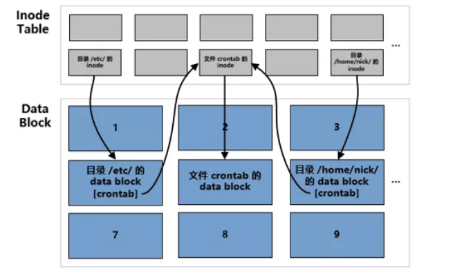
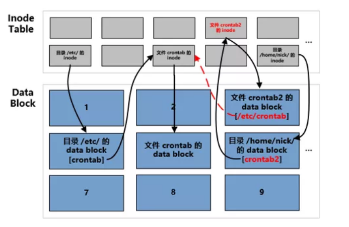

Linux ln命令
------
### 1.Hard Link


在 Linux 系统中，每个文件对应一个 inode，文件的内容在存储在 inode 指向的 data block 中。要读取该文件的内容，需要通过文件所在的目录中记录的文件名找到文件的 inode 号，然后通过inode 找到存储文件内容的 data block。
也就是说，文件名存储在目录中，inode 号执行文件存储的内容，文件名和 inode 之间有一个对应关系。那么多个文件名可不可以同时指向同一个 inode 呢？答案是可以的，这就是硬链接！从本质上来说，**硬链接只是在目录下新添加了一个文件名，这个文件名与一个已有文件的 inode 相关联。**

>硬链接在文件系统中的实现方式：
>

**硬链接的特点：**
- 几乎不额外占用空间
- 只要还有一个文件名引用着文件，文件就不会被真正删除
- 硬链接的文件类型被标记为“-”
- 创建硬链接时，文件的链接数会增加1

由于硬链接只是在目录中添加了一条包含文件名和 对应 inode 的记录，所以它几乎不会消耗额外的磁盘容量。
另外在删除硬链接所关联的文件时，其实只是删除了一条目录中的记录，真正的文件并不受影响，只有在删除最后一个硬链接时才会真正删除文件的内容数据。
**局限性：**

- 不能跨文件系统创建硬链接
- 不能链接目录

由于这两个限制，实际应用中硬链接并没有软链接使用广泛。
### 2.Symbolic Link
软链接的实现方式与硬链接有本质上的不同。创建软链接时会创建一个新的文件(分配一个 inode 和对应的 data block)，新文件的 data block 中存储了目标文件的路径。
- 软链接的文件类型被标记为“l”
- 创建软链接并不增加源文件的链接数
- 可以链接目录
- 可以跨文件系统创建软链接
>软链接在文件系统中的实现方式：
>
>从上图我们可以看出，软链接文件 crontab2 是一个实实在在的文件，有自己的 inode 和 data block。但是它的 data block 中保存的是目标文件的地址：/etc/crontab。

### 3.文件的链接数
- 创建硬链接文件时，文件的链接数会增加 1
- 创建软链接文件时，文件的链接数却不发生变化
- 一个目录文件的链接数：至少有两个硬链接，还有一个指向父目录的硬链接
>比如目录`/home/lxj`有两个硬链接，分别是：
>- `/home/lxj`
>- `/home/lxj/.`
>指向父目录的硬链接是：`/home/lxj/..`

### 4.ln命令
ln 命令用来在文件之间建立链接，其的常用方式为：
```linux
ln source target	#创建硬链接文件
ln -s source target	#创建软链接文件
还有一个比较常用的选项是 f，它会强制删除已经存在的目标文件。
```


