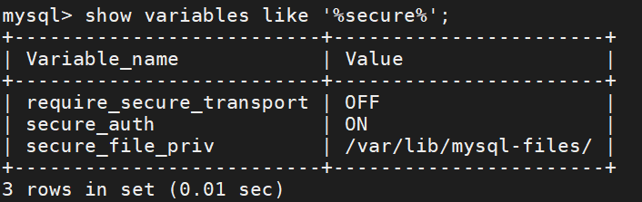

# mysql

<!-- TOC -->

- [mysql](#mysql)
  - [1 创建数据库并插入数据](#1-创建数据库并插入数据)
    - [1.1 创建数据库](#11-创建数据库)
    - [1.2 数据类型](#12-数据类型)
    - [1.3 插入数据](#13-插入数据)
  - [2 mysql的约束](#2-mysql的约束)
  - [3 SELECT语句详解](#3-select语句详解)
  - [4 数据库、数据表操作](#4-数据库数据表操作)
  - [5 索引、视图、导入和导出](#5-索引视图导入和导出)
    - [5.1 索引](#51-索引)
    - [5.2 视图](#52-视图)
    - [5.3 导入](#53-导入)
    - [5.4 导出](#54-导出)

<!-- /TOC -->

## 1 创建数据库并插入数据

```sql
# 打开 MySQL 服务
sudo service mysql start

#使用 root 用户登录
mysql -u root -p
```

**管理MySQL的命令：**

- `USE 数据库名;`//选择要操作的Mysql数据库，使用该命令后所有Mysql命令都只针对该数据库
- `SHOW DATABASES;`//列出 MySQL 数据库管理系统的数据库列表。
- `SHOW TABLES;`//显示指定数据库的所有表，使用该命令前需要使用 use 命令来选择要操作的数据库。
- `SHOW COLUMNS FROM 数据表;`//显示数据表的属性，属性类型，主键信息 ，是否为 NULL，默认值等其他信息
- `SHOW INDEX FROM 数据表;`//显示数据表的详细索引信息，包括PRIMARY KEY（主键）。
- `SHOW TABLES STATUS from 数据库名 LIKE 'string'\G;`//该命令将输出Mysql数据库管理系统的性能及统计信息。

### 1.1 创建数据库

`CREATE DATABASE 数据库名;`//创建数据库

**连接数据库：** `use 数据库名;`  

**删除数据库：** `drop database 数据库名;`  

**数据表(table)：** 简称表，它是数据库最重要的组成部分之一。数据库只是一个框架，表才是其中的实质内容。
**创建数据表：**

```sql
CREATE TABLE 表的名字
(
列名a 数据类型(数据长度),
列名b 数据类型(数据长度)，
列名c 数据类型(数据长度)
);
```

**删除数据表：**  `DROP TABLE 数据表名;`

### 1.2 数据类型

|数据类型|大小（字节）|用途|格式|
|-|-|-|-|
|INT|4|整数||
|FLOAT|4|单精度浮点数||
|DOUBLE|8|双精度浮点数||
|ENUM|--|单选，比如性别|ENUM('a', 'b', 'c')|
|SET|--|多选|SET('1', '3', '8')|
|DATE|3|日期|YYYY-MM-DD|
|TIME|3|时间点或持续时间|HH:MM:SS|
|YEAR|1|年份值|YYYY|
|CHAR|0~255|定长字符串||
|VARCHAR|0~255|变长字符串||
|TEXT|0~65535|长文本数据||

### 1.3 插入数据

`INSERT INTO 表的名字(列名a, 列名b, 列名c……) VALUES(值1， 值2， 值3……);`//向表中插入数据，如果数据是字符型，必须使用单引号或者双引号，如："value"。

**查询数据：** `SeLECT * FROM 表的名字;`

## 2 mysql的约束

- 约束是一种限制，它通过对表的行或列的数据做出限制，来确保表的数据的**完整性、唯一性**。

**五种约束：**

|约束类型|关键字|说明|
|-|-|-|
|主键|PRIMARY KEY|用于约束表中的一行，作为这一行的唯一标识符，在一张表中通过主键就能准确定位到一行，因此主键十分重要，主键不能有重复记录且不能为空|
|默认值|DEFAULT|当有 DEFAULT 约束的列，插入数据为空时，将使用默认值，只会在使用 INSERT 语句时体现出来|
|唯一|UNIQUE|规定一张表中指定的一列的值必须不能有重复值，即这一列每个值都是唯一的|
|外键|FOREIGN KEY|既能确保数据完整性，也能表现表之间的关系。一个表可以有多个外键，每个外键必须 REFERENCES (参考) 另一个表的主键，被外键约束的列，取值必须在它参考的列中有对应值|
|非空|NOT NULL|被非空约束的列，在插入值时必须非空。|

## 3 SELECT语句详解

**基本格式：** `SELECT 要查询的列名 FROM 表的名字 WHERE 限制条件;`

- 如果要查询表的所有内容，则把要查询的列名用一个星号*号表示，代表要查询表中所有的列：
`SELECT * FROM employee;`
- 如果要查看某个表的指定的列，比如要查看 employee 表的 name 和 age：
`SELECT name, age FROM employee;`

**数学符号条件：** WHERE限制条件，用于达到更加精确的查询。WHERE限制条件可以有数学符号(=,<,>,>=,<=)。比如：  
`SELECT name, age FROM employee WHERE age>20;`

**AND** 与 **OR** :WHERE 后面可以有不止一条限制，而根据条件之间的逻辑关系，可以用 [条件一 OR 条件二] 和 [条件一 AND 条件二] 连接。比如：

```sql
SELECT name, age FROM employee WHERE age<30 AND age>20;//20<age<30
SELECT name, age FROM employee WHERE age BETWEEN 20 AND 30;//[20,30]
```

**IN** 和 **NOT IN：** 用于筛选“在”或“不在”某个范围内的结果。比如：

```sql
SELECT name, age, phone, in_dpt FROM employee WHERE in_dpt IN ('dapt3', 'dpt4');//查询所在部门在 dpt3 或 dpt4 的人

SELECT name, age, phone, in_dpt FROM employee WHERE in_dpt NOT IN ('dapt1', 'dpt4');//查询所在部门既不是dpt1也不是dpt4的人
```

**对结果排序：** 关键词**ORDER BY** 默认的排序结果是升序排列，如果在后面加上关键词 **ASC 和 DESC**可指定升序或降序排序。

`SELECT name,age,salary,phone FROM employee ORDER BY salary DESC;`//按 salary 降序排列

**内置函数和计算：**
|函数名|作用|说明|
|-|-|-|
|COUNT|计数|可用于任何数据类型|
|SUM|求和|只能用于数字类数据类型|
|AVG|求平均值|只能用于数字类数据类型|
|MAX|最大值|可用于数值、字符串和日期时间数据类型|
|MIN|最小值|可用于数值、字符串和日期时间数据类型|

```sql
SELECT MAX(salary) AS max_salary, MIN(salary) FROM employee;
//计算出salary的最大、最小值,并且使用AS关键词把最大值被命名为了 max_salary
```

**子查询：** 上面讨论的 SELECT 语句都仅涉及一个表中的数据，然而有时必须处理多个表才能获得所需的信息。
例如：想要知道名为 "Tom" 的员工所在部门做了几个工程。员工信息储存在 employee 表中，但工程信息储存在 project 表中。

```sql
SELECT of_dpt, COUNT(proj_name) AS coount_project FROM project GROUP BY of_dpt 
HAVING of_dpt IN (SELECT in_dpt FROm employee WHERE name='xiaobai');
/*
包含两个 SELECT 语句，第二个 SELECT 语句将返回一个集合的数据形式，然后被第一个 SELECT 语句用 in 进行判断。
HAVING 关键字可以的作用和 WHERE 是一样的，都是说明接下来要进行条件筛选操作。
区别在于 HAVING 用于对分组后的数据进行筛选。
*/
```

**连接查询：** 在处理多个表时，子查询只有在结果来自一个表时才有用。但如果需要显示两个表或多个表中的数据，这时就必须使用连接 (join) 操作。连接的基本思想是把两个或多个表当作一个新的表来操作，如下：

```sql
SELECT id, name, people_num FROM employee, department
WHERE employee.in_dpt = department.dpt_name
ORDER BY id;
//查询各员工所在部门的人数，其中员工的 id 和 name 来自 employee 表，people_num 来自 department 表
```

使用**JOIN ON** 也是等价的：

```sql
SELECT id, name, people_num FROM employee JOIN department
ON employee.in_dpt = department.dpt_name
ORDER BY id;
```

## 4 数据库、数据表操作

**重命名表：**  

  ```sql
  RENAME TABLE 原名 TO 新名字;
  ALTER TABLE 原名 TO 新名;
  ALTER TABLE 原名 TO 姓名;
  ```

**删除表：**  

```sql
DROP TABLE 表名字;
```

**增加一列：**  

```sql
ALTER TABLE 表名字 ADD COLUMN 列名字 数据类型 约束;
ALTER TABLE 表名字 ADD 列名字 数据类型 约束;
//新增的列被默认放在表的最右边
//可以使用AFTER关键词来指定插入位置，比如：新增一列 weight(体重) 放置在 age(年龄) 的后面
ALTER TABLE employee ADD weight INT(4) DEFAULT 60 AFTER age;
//使用FIRST关键词来把新增的列放在第一列
ALTER TABLE employee ADD weight INT(4) DEFAULT 70 FIRST;
```

**删除一列：**  

```sql
ALTER TABLE 表名字 DROP COLUMN 列名字;
ALTER TABLE 表名字 DROP 列名字;
```

**重命名一列：**  重命名就是对一个列做修改(CHANGE)

```sql
//“数据类型” 不能省略，否则重命名失败
//当原列名和新列名相同的时候，指定新的数据类型或约束，就可以用于修改数据类型或约束。
//需要注意的是，修改数据类型可能会导致数据丢失，所以也需要慎重使用。
ALTER TABLE 表名字 CHANGE 原列名 新列名 数据类型 约束;
```

**改变数据类型：**  要修改一列的数据类型，除了使用刚才的 CHANGE 语句外，还可以用这样的 MODIFY 语句

- 修改数据类型必须小心，因为这可能会导致你的数据丢失。

```sql
ALTER TABLE 表名字 MODIFY 列名字 新数据类型;
```

**修改表中某个值：**  

- 必须要有WHERE条件

```sql
UPDATE 表名字 SET 列1=值1, 列2=值2 WHERE 条件;

//比如把 xiaowei 的age改为25，salary 改为 20000，就可以这样写
UPDATE employee SET age=25 ,salary=20000 WHERE name='xiaowei';
```

**删除一行记录：**  

- 和修改某个值一样也必须要有WHERE条件，否则整列的数据都会被删除

```sql
DELETE FROM 表名字 WHERE 条件;

//比如：把 xiaohong 那行的数据删除
DELETE FROM employee WHERE name="xiaohong";
```

## 5 索引、视图、导入和导出

### 5.1 索引

索引是一种可以提高数据库检索速度的一种数据结构。它的作用相当于一本书的目录，可以根据目录中的页码快速找到需要的内容。  
在表中建立索引，在索引中找到符合查询条件的索引值，通过索引值就可以快速找到表中的数据，可以大大地加快查询的速度  
**在一张表中的某个列建立索引：**

```sql
ALTER TABLE 表名字 ADD INDEX 索引名 (列名);
CREATE INDEX 索引名 ON 表名字 (列名);

//例如：
ALTER TABLE employee ADD INDEX idx_id (id);  
//在employee表的id列上建立名为idx_id的索引

CREATE INDEX idx_name ON employee (name);
//在employee表的name列上建立名为idx_name的索引
```

**查看索引：** `SHOW INDEX FROM 表名字;`

在使用 SELECT 语句查询的时候，语句中 WHERE 里面的条件，会自动判断有没有可用的索引。比如:有一个用户表，它拥有用户名(username)和个人签名(note)两个字段。其中用户名具有唯一性，并且格式有一定的限制，我们给用户名加上一个唯一索引；个性签名格式多变，而且允许不同用户使用重复的签名，不加任何索引。此时查找某个人如下：

```sql
 select * from user where username=?;
 //上面比下面高效，有索引查询更加快
 select * from user where note=?;
```

### 5.2 视图

**视图是从一个或多个表中导出来的表，是一种虚拟存在的表** 。它就像一个窗口，通过这个窗口可以看到系统专门提供的数据，这样，用户可以不用看到整个数据库中的数据，而只关心对自己有用的数据。

**对于视图的理解：**

- 数据库中只存放了视图的定义，而没有存放视图中的数据，这些数据存放在原来的表中；
- 使用视图查询数据时，数据库系统会从原来的表中取出对应的数据；
- 视图中的数据依赖于原来表中的数据，一旦表中数据发生改变，显示在视图中的数据也会发生改变；
- 在使用视图的时候，可以把它当作一张表。

**创建视图：**

```sql
CREATE VIEW 视图名（列a，列b，列c） AS SELECT 列1,列2,列3 FROM 表名字;
//可见创建视图的语句，后半句是一个 SELECT 查询语句，
//所以视图也可以建立在多张表上，只需在 SELECT 语句中使用子查询或连接查询。

//创建一个简单的视图，名为 v_emp，包含 v_name，v_age，v_phone 三个列：
CREATE VIEW v_emp (v_name, v_age, v_phone) AS SELECT name, age, phone FROM employee;
//查看视图v_emp
SELECT * FROM v_emp;
```

### 5.3 导入

|导入类型|描述|
|-|-|
|数据文件的导入|导入方式只包含数据，导入规则由数据库系统完成|
|SQL文件的导入|相当于执行该文件中包含的 SQL 语句，语法为：`source *.sql;`可以实现多种操作，包括删除，更新，新增，甚至对数据库的重建。|

**数据文件的导入：** 可以把一个文件里的数据保存进一张表。导入语句如下

```sql
由于导入导出大量数据都属于敏感操作，根据 mysql 的安全策略，
导入导出的文件都必须在指定的路径下进行
LOAD DATA INFILE '文件路径和文件名' INTO TABLE 表名字;
```

导入前，要在 mysql 终端中查看路径变量：


注意` secure_file_priv `变量指定的安全路径 ，要导入数据文件，需要将该文件移动到安全路径下。
` secure_file_priv `变量详解如下：


文件放置好后，进行导入数据文件：
```sql
//本例中我的文件就应该放在`D:\Linux\rootfs\var\lib\mysql-files`里
LOAD DATA INFILE 'D:\Linux\rootfs\var\lib\mysql-files\in.txt' INTO TABLE employee;
```

### 5.4 导出

导出与导入是相反的过程，是把数据库某个表中的数据保存到一个文件之中。导出语句基本格式为：

```sql
SELECT 列1，列2 INTO OUTFILE '文件路径和文件名' FROM 表名字;
注意：语句中 “文件路径” 之下不能已经有同名文件。

如果导出报错，可能是 MySQL 没有权限对相应目录进行操作， 查看系统变量 tmpdir， 如下所示，tmpdir 变量指定路径为 /tmp。
```