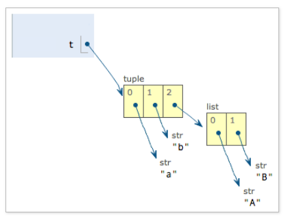
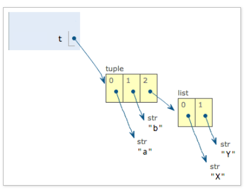

字符串和编码
-------
## 1.字符编码
- ASCII编码：1个字节
- Unicode编码：通常2个字节，有点浪费存储空间
- UTF-8编码：可变长编码，UTF-8 编码把一个 Unicode 字符根据不同的数字大小编码成 1-6 个字节，常用的英文字母被编码成 1 个字节，汉字通常是 3 个字节，只有很生僻的字符才会被编码成 4-6 个字节。

计算机系统通用的字符编码工作方式：
在计算机内存中，统一使用 Unicode 编码，当需要保存到硬盘或者需要传输的时候，就转换为 UTF-8 编码。

## 2.python的字符串
在最新的 Python 3 版本中，字符串是以 Unicode 编码的，也就是说，Python 的字符串支持多语言。
由于 Python 的字符串类型是str，在内存中以 Unicode 表示，一个字符对应若干个字节。如果要在网络上传输，或者保存到磁盘上，就需要把str变为以字节为单位的bytes：
```python
'ABC'.encode('ascii')	#使用encode()函数把str转换成指定编码方式的bytes,以字节来进行传输
'中文'.encode('utf-8')
```

反过来，如果我们从网络或磁盘上读取了字节流，那么读到的数据就是bytes。要把bytes变为str，就需要用decode()方法：
```python
b'ABC'.decode('ascii')	#使用decode()函数把bytes解码为str,来进行显示处理
b'\xe4\xb8\xad\xe6\x96\x87'.decode('utf-8')
```

由于 Python 源代码也是一个文本文件，所以，当你的源代码中包含中文的时候，在保存源代码时，就需要务必指定保存为 UTF-8 编码。当 Python 解释器读取源代码时，为了让它按 UTF-8 编码读取，我们通常在文件开头写上这两行：
```python
#!/usr/bin/env python3	#告诉Linux/OS X系统，这是一个Python可执行程序，Windows系统会忽略这个注释；
# -*- coding: utf-8 -*-	#告诉Python解释器，按照UTF-8编码读取源代码，否则，你在源代码中写的中文输出可能会有乱码。
```
申明了 UTF-8 编码并不意味着你的.py文件就是 UTF-8 编码的，必须并且要确保文本编辑器正在使用 UTF-8 without BOM 编码.

## 3.格式化
### 3.1法一-占位符
输出格式化的字符串,在 Python 中，采用的格式化方式和 C 语言是一致的，用%构成的占位符来实现，举例如下：
```python
>>> 'Hello, %s' % 'world'
'Hello, world'
>>> 'Hi, %s, you have $%d.' % ('Michael', 1000000)
'Hi, Michael, you have $1000000.'
```
常见的占位符:
占位符|替换内容
-|-
%d|整数
%f|浮点数
%s|字符串
%x|十六进制整数
如果你不太确定应该用什么，%s永远起作用，它会把任何数据类型转换为字符串：
```python
>>> 'Age: %s. Gender: %s' % (25, True)
'Age: 25. Gender: True'
```
有些时候，字符串里面的%是一个普通字符怎么办？这个时候就需要转义，用%%来表示一个%：
```python
>>> 'growth rate: %d %%' % 7  
'growth rate: 7 %'
```
### 3.2法二-format()
另一种格式化字符串的方法是使用字符串的format()方法，它会用传入的参数依次替换字符串内的占位符{0}、{1}……，不过这种方式写起来比 % 要麻烦得多：
```python
>>> 'Hello, {0}, 成绩提升了 {1:.1f}%'.format('小明', 17.125)
'Hello, 小明, 成绩提升了 17.1%'
```

list和tuple
--------
## 1.list
- list 是一种有序的集合叫有序列表，可以随时添加和删除其中的元素
- list 里面的元素的数据类型也可以不同,list 元素也可以是另一个 list
- 用[]表示
```python
>>> s = ['python', 'java', ['asp', 'php'], 'scheme']
>>> len(s)
4
```

## 2.tuple
- 元组-另一种有序列表,一旦初始化就不能修改,使用()表示
- 当你定义一个 tuple 时，在定义的时候，tuple 的元素就必须被确定下来
- 注意"可变的"tuple:
```python
>>> t = ('a', 'b', ['A', 'B'])
>>> t[2][0] = 'X'
>>> t[2][1] = 'Y'
>>> t
('a', 'b', ['X', 'Y'])
```
tuple 所谓的 “不变” 是说，tuple 的每个元素，指向永远不变。即指向'a'，就不能改成指向'b'，指向一个 list，就不能改成指向其他对象，但指向的这个 list 本身是可变的！如下图所示:

 
最后,只有 1 个元素的 tuple 定义时必须加一个逗号，这是因为括号()既可以表示 tuple，又可以表示数学公式中的小括号，这就产生了歧义:
```python
>>> t = (1,)
>>> t
(1,)	#Python 在显示只有 1 个元素的 tuple 时，也会加一个逗号,，以免你误解成数学计算意义上的括号。
```

dict和set
-------
## 1.dict
dict 全称 dictionary，在其他语言中也称为 map，使用键 - 值（key-value）存储，具有极快的查找速度。
```python
>>> d = {'Michael': 95, 'Bob': 75, 'Tracy': 85}	#定义一个字典
>>> d['Michael']	#通过key取value
95
```
- 用{}表示
- 把数据放入 dict 的方法，除了初始化时指定外，还可以通过 key 放入：
    ```python
    >>> d['Adam'] = 67
    >>> d['Adam']
    67
    ```
- `get()`查询key是否存在dict里
- `pop(key)`删除相应的key-value
-  dict 内部存放的顺序和 key 放入的顺序是没有关系的

dict|list
-|-
查找和插入的速度极快，不会随着 key 的增加而变慢|查找和插入的时间随着元素的增加而增加
需要占用大量的内存，内存浪费多|占用空间小，浪费内存很少
所以，dict 是用空间来换取时间的一种方法。

## 2.set
set 和 dict 类似，也是一组 key 的集合，但不存储 value。由于 key 不能重复，所以，在 set 中，没有重复的 key。
- 使用set(list)定义集合
- 需要一个list作为输入集合,重复元素会自动被set过滤,set是无序的
    ```python
    >>> s = set([1, 1, 2, 2, 3, 3])
    >>> s
    {1, 2, 3}
    ```
- add(key)方法可以添加元素到 set 中，可以重复添加，但不会有效果
- remove(key)方法可以删除元素
- set 可以看成数学意义上的无序和无重复元素的集合，因此，两个 set 可以做数学意义上的交集、并集等操作
    ```python
    >>> s1 = set([1, 2, 3])
    >>> s2 = set([2, 3, 4])
    >>> s1 & s2
    {2, 3}
    >>> s1 | s2
    {1, 2, 3, 4}
    ```

条件判断
----------
```python
if <条件判断1>:
    <执行1>
elif <条件判断2>:
    <执行2>
elif <条件判断3>:
    <执行3>
else:
    <执行4>
```

循环
-------
## 1.`for...in`循环
`for x in ...`循环就是把每个元素代入变量x，然后执行缩进块的语句

```python
sum = 0	#计算 1-10 的整数之和
for x in [1, 2, 3, 4, 5, 6, 7, 8, 9, 10]:
    sum = sum + x
print(sum)
```

## 2.`while`循环
```python
sum = 0
n = 99	#计算100以内所有奇数之和
while n > 0:
    sum = sum + n
    n = n - 2
print(sum)
```