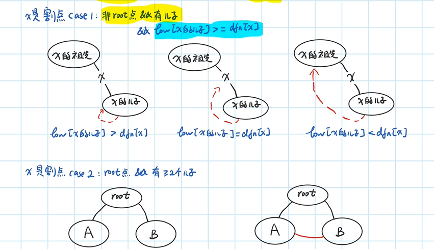

# 刷题总结

## 1 数组

- 二分：基本有序查找时可以用二分，关键是确定循环不变量和区间
- 双指针、三指针、滑动区间
  - 双指针的循环不变量：[0, slow] 与 [0, slow)的区别，leetcode第26、80题，有序数组每个元素不能出现超过k次

    ```cpp
    if(nums.size() < k+1) return nums.size();
    int slow(k), fast(k+1); //[0, slow)
    for(; fast<nums.size(); fast++)
        if(nums[fast] != nums[slow-k]) nums[slow++] = nums[fast];
    return slow;

    if(nums.size() < k+1) return nums.size();
    int slow(k-1), fast(k); //[0, slow]
    for(; fast<nums.size(); fast++)
        if(nums[fast] != nums[slow-k+1]) nums[++slow] = nums[fast];
    return slow+1;
    ```

- 有时候从数组头部处理不好时，可以试试逆向思维从数组尾部开始
- 归并排序中的一次二路归并算法Merge、快排中的一次划分算法Partition(每一趟都是确定了povit排序后的位置)都是使用了双指针的思想
- 设计到字符串可能用到的几个内置函数：

    |函数|作用|
    |-|-|
    |islower(char c)|是否为小写字母|
    |isupper(char c)|是否为大写字母|
    |isdigit(char c)|是否为数字|
    |isalpha(char c)|是否为字母|
    |isalnum(char c)|是否为字母或数字|
    |toupper(char c)|字母小转大|
    |tolower(char c)|字母大转小|

- 重要的滑动窗口：
  - 注意`unordered_map`的使用：可以使用方括号访问键对应的值 map[key]。需要注意的是，如果该 key 不存在，C++ 会自动创建这个 key，并把 map[key] 赋值为 0。
  - 当移动 right 扩大窗口，应该更新哪些数据？--应该增加 window 计数器
  - 什么条件下开始移动 left 缩小窗口？--match满足need时
  - 当移动 left 缩小窗口，应该更新哪些数据？--应该减少 window 计数器
  - 我们要的结果应该在扩大窗口时还是缩小窗口时进行更新？--缩小窗口时

    ```cpp
    void SlidingWindow(string s, string t) {
        unordered_map<char, int> need, window;
        for(char c : t) need[c]++;
        int left(0), right(0), match(0);
        while(right < s.size()) {
            char c = s[right++];    //右移窗口
            /* 进行窗口内数据的更新 */
            ...
            while(window needs shrink) {    //判断窗口是否要收缩
                char d = s[left++]; //左移窗口
                /* 进行窗口内数据的更新 */
                ...
            }
        }
    }
    ```

## 笔试题

- 做题一般先暴力，在查看能不能发现什么性质，从而进行优化
- 针对容器中的边界情况，有时候加入哨兵可以避免特判的情况
- 除法上取整[a/b] 转换为下取整 [(a+b-1)/b]
- stl中的set方法:low_bound(x)大于等于x的第一个数；upper_bound(x)大于x的第一个数；返回的都是迭代器
- 括号序列合法（'('=1, ')'=-1）  <=>    所有的前缀和>=0, 且总和为0

    ```cpp
    // 括号序列题往往还要reverse后，左右括号转换下，再做一遍，解决这种特例：((((((())
    start当前枚举这段的开头
    ans前缀和
    （ = 1
    ） = -1
    if ans < 0: 这个区间不合法（右括号多，因为前缀和，所以多的右括号一定靠右了）start = i+1, ans = 0;
    if ans > 0: 继续做
    if ans == 0: [start, i]是一段合法的括号序列
    ```

- 对于环形数组q[N]: 可以将环形展开成链形数组，q[N] ---> q[2N]，把数组复制一份接在后面就可以了

- 快读模板：

    ```cpp
    inline int read() {
        int s=0, w=1;
        char ch = getchar();
        while (ch<'0' || ch>'9') {if(ch == '-') w= -1; ch = getchar();}
        while (ch>='0' && ch<='9') s = s*10 + ch - '0', ch = getchar();
        return s*w;
    }
    ```

### 1 tarjan算法

#### 1.1 tarjan求强连通图

- DFS遍历图的方法：


- tarjan算法求强连通图


- tarjan代码示意图：可以在 O(n+m)时间内求出有向图的所有强联通分量。


```cpp
// 先存储图 邻接表
int h[N], e[M], ne[M], idx; // 存储有向图, h[]需要初始化成-1
void add(int a, int b) {
    e[idx] = b, ne[idx] = h[a], h[a] = idx++;
}

// tarjan求连通图
// dfn[i]:i被dfs访问的时间点（次序）； low[i]:i可以通过自己的儿子回到的最早的时间点
int dfn[N], low[N], time = 1;
stack<int> stk;
bool instk[N];  // 标记节点是否在栈中
int bent, belong[N];  
// bent:给连通图打标号（有几个连通图）；belong[i]:标记节点i属于哪个连通图

void tarjan(int i) {
    // 上来先入栈
    dfn[i] = low[i] = time++;
    stk.push(i), instk[i] = true;
    // dfs遍历
    for(int k = h[i]; k != -1; k = ne[k]) {
        int j = e[k];
        if(!dfn[j]) {
            tarjan(j);
            low[i] = min(low[i], low[j]);
        }
        else if(instk(j)) low[i] = min(low[i], low[j]);
    }
    // 出栈，每一次条件成立时，栈内从栈头到i这几个节点构成一个连通块
    if(dfn[i] == low[i]) {
        ++bent; // 维护我们要的信息，连通图个数
        int tmp;
        do {
            tmp = stk.top(), stk.pop();
            instk[tmp] = false;
            belong[tmp] = bent;     // 维护我们想要的信息，节点属于哪个连通图集合
        } while(tmp != i)
    }
}
```

#### 1.2 tarjan求割点与桥

- 割点：军队打仗，就优先破坏敌军的割点，让敌军无法交流
- 桥：

1. 割点与桥的定义

    

2. 算法思想

    - 割点算法思想：

        
        

    - 桥算法思想：

        

    - 示例：

        

3. 代码实现：

    - 针对的是无向图

    

    ```cpp
    // 邻接表存储图， 如果是稠密图，自行换为邻接矩阵g[N][N]
    int h[N], e[M], ne[M], idx;     // h[]初始化为-1
    void add (int a, int b) {
        e[idx] = b, ne[idx] = h[a], h[a] = idx++;
    }
    // 求割点
    int dfn[N], low[N], fa[N], time = 1; // fa[]初始化为-1，表示没有父亲
    bool cut[N];    // 记录割点
    vector<pair<int, int>> bridge;  // 记录桥

    void tarjan(int x) {
        dfn[x] = low[x] = time++;
        int child = 0;  // 针对root节点，要看儿子个数
        for(int k = h[x]; k != -1; k = ne[k]) {
            int y = e[k];
            // y没有被访问过，说明y是x的儿子
            if(!dfn[y]) {
                child++, fa[y] = x; // 记录父子关系
                tarjan(y);
                // root节点
                if(fa[x] == -1 && child >= 2) cut[x] = true;
                // 非root节点，由于从x-->y，所以y一定是x的儿子
                if(fa[x] != -1 && low[y] >= dfn[x]) cut[x] = true;
                // (x, y)是不是桥
                if(low[y] > dfn[x]) bridge.push_back({x, y});

                // 更新low[x]----重点
                low[x] = min(low[x], low[y]);
            }
            // y如果已经访问过，且y不是x的父亲
            else if(fa[x] != y) low[x] = min(low[x], low[y]);
            // y是x的父亲，不用管
        }
    }

    ```
