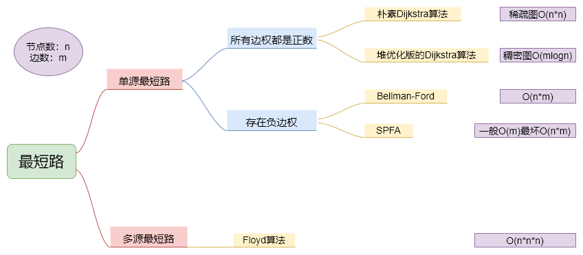
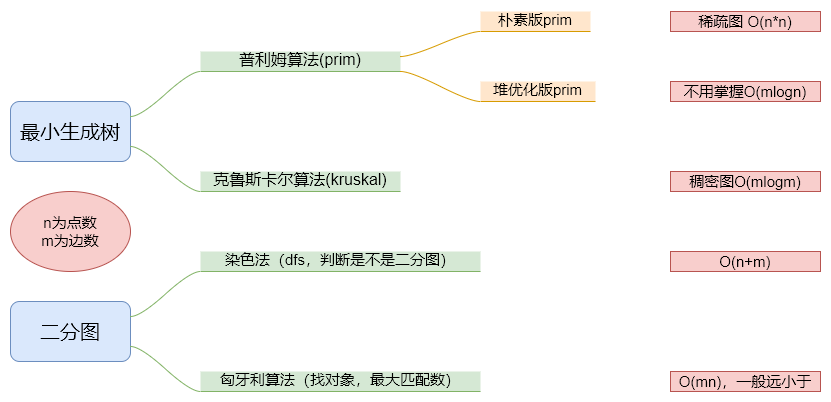

# 搜索与图论

## 1 DFS 与 BFS

||数据结构|空间复杂度|特性|
|-|-|-|-|
|DFS|stack|O(h)|不具有最短性|
|BFS|queue|O(2^h)|最短路(最小步数，最少操作之类的)|

### 1.1 DFS

- 俗称暴搜，顺序最关键
- 回溯与剪枝
- 掌握全排列、n皇后问题、排列、组合、子集
- 思路：1. 截止条件 -> 2. 候选节点（候选集合） -> 2.1 筛选

```cpp
void dfs(args) {
    1.截止条件

    for each 2.候选节点
        2.1筛选
}
```

### 1.2 BFS

- 状态表示：bfs要把遍历过的状态标记，防止死循环
- 状态之间的距离表示

- 框架：

```cpp
void bfs(int start) {
    queue <--- 初始状态start
    used[start] = true;

    while(q不空) {  // 一层的一层的去遍历，所以到每个状态的路径都是最短的
        t <--- 取q队头元素，然后出队
        for_each t所有能走到的下一个状态v // 筛选
            used[v] = true;
            q <--- v;
    }
}

上下左右四个方向可以表示为：
int dx = {-1, 1, 0, 0};
int dy = {0, 0, -1, 1};

// queue <--- 初始状态

// while(queue不空)
//     t <--- 队头
//     扩展t
```

## 2 树与图的存储

- 树是一种特殊的图（无环连通图），与图的存储方式相同。
- 对于无向图中的边ab，存储两条有向边a->b, b->a。所以无向图就是特殊的有向图
- 因此我们可以只考虑有向图的存储。
  - 邻接矩阵：g[a][b] 存储边a->b
  - 邻接表：
    - 图有几个点就开几个单链表，h[N]是各个单链表的头结点。假如图有4个节点，那么就开辟数组h[4]
    - 以h[i]为头结点的链表中存的是节点i可以到达的所有节点

    ```cpp
    // 对于每个点k，开一个单链表，存储k所有可以走到的点。h[k]存储这个单链表的头结点
    int h[N], e[N], ne[N], idx;
    // 添加一条边a->b
    // 在好h[a]链表中进行头插b节点
    // idx表示e[N]中已经用到了哪个点，存的是节点在e[N]的下标
    // ne[idx]表示e[idx]的下一个节点在e[N]中的下标
    // a,b对应的是图中节点的编号，图中的节点都是用编号来进行区分的，e[N]中就是节点编号
    void add(int a, int b) {
        // 头插b，因为h[a]表示a所有可以到达的节点，所以h[a]具体存放的是谁不重要
        // 从哪个节点开始都一样，下标a就说明了h[a]链表的属性
        e[idx] = b, ne[idx] = h[a], h[a] = idx ++ ;
    }
    // 初始化
    idx = 0;
    memset(h, -1, sizeof h);
    // 因为是头插，所以h[N]，这么多的链表一定是以-1作为尾节点
    ```

## 4 树与图的深度优先遍历

- 因为树和图的遍历，每个节点只会被遍历一次，所以总的时间复杂度为O(n+m), n表示点数, m表示边数。
- 特点：可以算出每一个子树的节点个数

```cpp
int dfs(int u) {
    st[u] = true; // bool数组st[u] 表示点u已经被遍历过
    // 遍历节点u所有的邻边，候选集合
    for (int i = h[u]; i != -1; i = ne[i]) {
        int j = e[i];
        if (!st[j]) dfs(j); // 筛选
    }
}
```

## 5 树与图的广度优先遍历

```cpp
思路：
queue <-------- 1
while(queue不空){
    tt <----- 队头
    拓展t所有邻点：x
    if(x 未遍历)
        queue <---- x
        d[x] = d[tt] + 1
}


queue<int> q;
st[1] = true; // 表示1号点已经被遍历过
q.push(1);
while (q不空) {
    int t = q.front();
    q.pop();
    // 遍历t节点所有的邻边，候选集合
    for (int i = h[t]; i != -1; i = ne[i]) {
        int j = e[i];
        if (!st[j]) {   // 筛选
            st[j] = true; // 表示点j已经被遍历过
            q.push(j);
        }
    }
}
```

## 6 拓扑排序

- 针对的是有向图
- 拓扑序列：所有的边都是从前指向后的顺序（有向无环图一定存在拓扑序列）
- 利用树和图的宽度优先遍历，节点的入度

```cpp
思路：
queue <-------- 所有入度为0的点
while(queue不空){
    tt <----- 队头
    枚举 tt 的所有出边 tt ---> j
    删除 tt ---> j, j的入度减1 d[j]--
    if(d[j] == 0)
        queue <------ j
}


// 没有使用stl的queue清晰，主要就是根据节点的入度来做
bool topsort() {
    int hh = 0, tt = -1;
    // d[i] 存储点i的入度
    for (int i = 1; i <= n; i ++ )
        if (!d[i])
            q[ ++ tt] = i;

    while (hh <= tt) {
        int t = q[hh ++ ];
        for (int i = h[t]; i != -1; i = ne[i]) {
            int j = e[i];
            if (-- d[j] == 0)
                q[ ++ tt] = j;
        }
    }
    // 如果所有点都入队了，说明存在拓扑序列；否则不存在拓扑序列。
    return tt == n - 1;
}
```

## 7 最短路问题



### 7.1 朴素dijkstra算法

```cpp
int g[N][N];  // 存储每条边
int dist[N];  // 存储1号点到每个点的最短距离
bool st[N];   // 存储每个点的最短路是否已经确定

// 求1号点到n号点的最短路，如果不存在则返回-1
int dijkstra() {
    memset(dist, 0x3f, sizeof dist);
    dist[1] = 0;
    for (int i = 0; i < n - 1; i ++ ) {
        int t = -1;     // 在还未确定最短路的点中，寻找距离最小的点
        for (int j = 1; j <= n; j ++ )
            if (!st[j] && (t == -1 || dist[t] > dist[j]))
                t = j;

        // 用t更新其他点的距离
        for (int j = 1; j <= n; j ++ )
            dist[j] = min(dist[j], dist[t] + g[t][j]);

        st[t] = true;
    }
    if (dist[n] == 0x3f3f3f3f) return -1;
    return dist[n];
}
```

### 7.2 堆优化版dijsktra算法

```cpp
using PII = pair<int, int>;
int n;                             // 点的数量
int h[N], w[N], e[N], ne[N], idx;  // 邻接表存储所有边
int dist[N];        // 存储所有点到1号点的距离
bool st[N];         // 存储每个点的最短距离是否已确定

// 求1号点到n号点的最短距离，如果不存在，则返回-1
int dijkstra() {
    memset(dist, 0x3f, sizeof dist);
    dist[1] = 0;
    priority_queue<PII, vector<PII>, greater<PII>> heap;
    heap.push({0, 1});      // first存储距离，second存储节点编号

    while (heap.size()) {
        auto t = heap.top();
        heap.pop();

        int ver = t.second, distance = t.first;

        if (st[ver]) continue;
        st[ver] = true;
        // 用t节点更新其他节点的距离，其实更新的是从ver出去的所有边
        // 所以最后就是遍历了所有点出去的所有边：m
        for (int i = h[ver]; i != -1; i = ne[i]) {
            int j = e[i];
            if (dist[j] > distance + w[i]) {
                dist[j] = distance + w[i];
                heap.push({dist[j], j});
            }
        }
    }
    if (dist[n] == 0x3f3f3f3f) return -1;
    return dist[n];
}
```

### 7.3 bellman-ford算法

```cpp
思路：
    for n次
        for 所有边 a,b,w (松弛操作)
            dist[b] = min(dist[b],back[a] + w)
注意：back[]数组是上一次迭代后dist[]数组的备份，由于是每个点同时向外出发，因此需要对dist[]数组进行备份，若不进行备份会因此发生串联效应，影响到下一个点

注意在模板题中需要对下面的模板稍作修改，加上备份数组，详情见模板题。

int n, m;       // n表示点数，m表示边数
int dist[N];        // dist[x]存储1到x的最短路距离

struct Edge     // 边，a表示出点，b表示入点，w表示边的权重
{
    int a, b, w;
}edges[M];

// 求1到n的最短路距离，如果无法从1走到n，则返回-1。
int bellman_ford()
{
    // 初始化，起点距离为0
    memset(dist, 0x3f, sizeof dist);
    dist[1] = 0;

    // 如果第n次迭代仍然会松弛三角不等式，就说明存在一条长度是n+1的最短路径，
    // 由抽屉原理，路径中至少存在两个相同的点，说明图中存在负权回路。
    // 重要：第i次循环表示了从起点不超过i条边到达终点的距离，
    // 所以n可以修改为限制不超过几条边的边数
    for (int i = 1; i <= n; i ++ )
    {
        // 遍历所有的边
        // 因为初始化了起点的距离为0，所以第i次迭代更新了距离起点 i条边以内的点的距离
        // 这里一定要想好，从起点开始，i每加一次，只是往前推进了一步
        // 如果不使用备份数组，那么就会串联更新，第i次迭代的的距离一定是经过i条边的距离
        for (int j = 0; j < m; j ++ )
        {
            int a = edges[j].a, b = edges[j].b, w = edges[j].w;
            if (dist[b] > dist[a] + w)
                dist[b] = dist[a] + w;
        }
    }

    if (dist[n] > 0x3f3f3f3f / 2) return -1;
    return dist[n];
}
```

### 7.4 SPFA算法

- SPFA 算法是 Bellman-Ford算法 的队列优化算法的别称，通常用于求含负权边的单源最短路径，以及判负权环。SPFA一般情况复杂度是O(m)最坏情况下复杂度和朴素 Bellman-Ford 相同，为O(nm)
- 求最短路：

```cpp
思路：
queue <– 1
while queue 不为空
    (1) t <– 队头
    queue.pop()
    (2)用 t 更新所有出边 t –> b，权值为w
    queue <– b (若该点被更新过，则拿该点更新其他点)


int n;      // 总点数
int h[N], w[N], e[N], ne[N], idx;       // 邻接表存储所有边
int dist[N];        // 存储每个点到1号点的最短距离
bool st[N];     // 存储每个点是否在队列中

// 求1号点到n号点的最短路距离，如果从1号点无法走到n号点则返回-1
int spfa()
{
    memset(dist, 0x3f, sizeof dist);
    dist[1] = 0;

    queue<int> q;
    q.push(1);
    st[1] = true;

    while (q.size())
    {
        auto t = q.front();
        q.pop();

        st[t] = false;

        for (int i = h[t]; i != -1; i = ne[i])
        {
            int j = e[i];
            // 注意下面不能用dist[j] = min(dist[j], dist[t] + w[i]);
            // 因为我们只把更新过的dist[]的点加入q
            if (dist[j] > dist[t] + w[i])
            {
                dist[j] = dist[t] + w[i];
                if (!st[j])     // 如果队列中已存在j，则不需要将j重复插入
                {
                    q.push(j);
                    st[j] = true;
                }
            }
        }
    }

    if (dist[n] == 0x3f3f3f3f) return -1;
    return dist[n];
}
```

- 判断是否存在负环：
    1. dist[x] 记录当前1到x的最短距离
    2. cnt[x] 记录当前最短路的边数，初始每个点到1号点的距离为0，只要他能再走n步，即cnt[x] >= n,则表示该图中一定存在负环，由于从1到x至少经过n条边时，则说明图中至少有n + 1个点，表示一定有点是重复使用
    3. 若dist[j] > dist[t] + w[i],则表示从t点走到j点能够让权值变少，因此进行对该点j进行更新，并且对应cnt[j] = cnt[t] + 1,往前走一步
    4. 注意：该题是判断是否存在负环，并非判断是否存在从1开始的负环，因此需要将所有的点都加入队列中，更新周围的点

```cpp
int n;      // 总点数
int h[N], w[N], e[N], ne[N], idx;       // 邻接表存储所有边
int dist[N], cnt[N];        // dist[x]存储1号点到x的最短距离，cnt[x]存储1到x的最短路中经过的点数
bool st[N];     // 存储每个点是否在队列中

// 如果存在负环，则返回true，否则返回false。
bool spfa()
{
    // 不需要初始化dist数组,元素为0即可
    // 原理：如果某条最短路径上有n个点（除了自己），那么加上自己之后一共有n+1个点
    // 由抽屉原理一定有两个点相同，所以存在环。

    queue<int> q;
    for (int i = 1; i <= n; i ++ )
    {
        q.push(i);
        st[i] = true;
    }

    while (q.size())
    {
        auto t = q.front();
        q.pop();

        st[t] = false;

        for (int i = h[t]; i != -1; i = ne[i])
        {
            int j = e[i];
            if (dist[j] > dist[t] + w[i])
            {
                dist[j] = dist[t] + w[i];
                cnt[j] = cnt[t] + 1;
                // 如果从1号点到x的最短路中包含至少n个点（不包括自己），则说明存在环
                if (cnt[j] >= n) return true;
                if (!st[j])
                {
                    q.push(j);
                    st[j] = true;
                }
            }
        }
    }

    return false;
}
```

### 7.5 floyd算法

- 最简单的算法，基于动态规划，三重循环
- 求解多源最短路，时间复杂度O(n*n*n)，看见n很小的话(几百以内)，果断尝试

```cpp
int d[N][N];    // 邻接矩阵存储
初始化：
    for (int i = 1; i <= n; i ++ )
        for (int j = 1; j <= n; j ++ )
            if (i == j) d[i][j] = 0;
            else d[i][j] = INF;

// 算法结束后，d[a][b]表示a到b的最短距离
void floyd()
{
    for (int k = 1; k <= n; k ++ )
        for (int i = 1; i <= n; i ++ )
            for (int j = 1; j <= n; j ++ )
                d[i][j] = min(d[i][j], d[i][k] + d[k][j]);
}
```

## 8 最小生成树



## 9 二分图

- 二分图：一个图是二分图 <=> 当且仅当图中不含奇数环（由奇数条边形成的一个环）
- 将所有点分成两个集合，使得所有边只出现在集合之间，就是二分图

### 9.1 染色法

- 判断一个图是不是二分图
- 染色可以使用1和2区分不同颜色，用0表示未染色
- 遍历所有点，每次将未染色的点进行dfs, 默认染成0或1
- 由于某个点染色成功不代表整个图就是二分图,因此只有某个点染色失败才能立刻break/return
- 染色失败指的是有一条边的两端点染了相同的颜色

```cpp
思路：
    for n次迭代
        if i 未染色
            dfs(i, 1)  深度优先遍历, 把i所在的连通块整个染一遍，染色失败直接返回

int n;      // n表示点数
int h[N], e[M], ne[M], idx;     // 邻接表存储图
int color[N];       // 表示每个点的颜色，-1表示未染色，0表示白色，1表示黑色

// 参数：u表示当前节点，c表示当前点的颜色
bool dfs(int u, int c)
{
    color[u] = c;
    for (int i = h[u]; i != -1; i = ne[i])
    {
        int j = e[i];
        if (color[j] == -1)
        {   // j没有染色，对j染色下去，看有没有矛盾
            if (!dfs(j, !c)) return false;
        }   // j染过色，就直接看j的颜色与u的颜色有没有矛盾
        else if (color[j] == c) return false;
    }

    return true;
}

bool check()
{
    memset(color, -1, sizeof color);    // 这里使用-1表示未染色
    bool flag = true;                   // 表示染色过程有没有矛盾
    for (int i = 1; i <= n; i ++ )      // n次迭代，判断n个点
        // 利用dfs进行染色
        if (color[i] == -1)     // 如果当前点没有染色，需要进行染色
            if (!dfs(i, 0))     // dfs返回false就说明有矛盾发生
            {
                flag = false;
                break;
            }
    return flag;                // 染色过程完美，没有矛盾，直接返回true
}
```

### 9.2 匈牙利算法

- 给定一个二分图，求最大匹配（匹配指的是任意两个边没有公共点）

```cpp
int n1, n2;     // n1表示第一个集合中的点数，n2表示第二个集合中的点数
int h[N], e[M], ne[M], idx;     // 邻接表存储所有边，匈牙利算法中只会用到从第一个集合指向第二个集合的边，所以这里只用存一个方向的边
int match[N];       // 存储第二个集合中的每个点当前匹配的第一个集合中的点是哪个，女生的对象
bool st[N];     // 表示第二个集合中的每个点是否已经被遍历过,也就是说改女生是否看过了

bool find(int x)
{
    // 列举小伙x所有中意的对象。
    for (int i = h[x]; i != -1; i = ne[i])
    {
        int j = e[i];
        // 如果女生j没有被看过
        if (!st[j])
        {
            st[j] = true;
            // 女生j没有主 -> 直接与男生x匹配
            // 女生j有主 -> 找到那个男生，帮他重新找一个他中意的女生
            if (match[j] == 0 || find(match[j]))
            {
                // 这下女生j就和x成功匹配了
                match[j] = x;
                return true;
            }
        }
    }
    // 所有中意的对象都没找到，那就只能单身了
    return false;
}

// 求最大匹配数，依次枚举第一个集合中的每个点能否匹配第二个集合中的点
int res = 0;
// 给每个男生找对象
for (int i = 1; i <= n1; i ++ )
{
    memset(st, false, sizeof st);   // 给每个女生盖上盖头
    if (find(i)) res ++ ;   // 匹配成功的对数
}
```